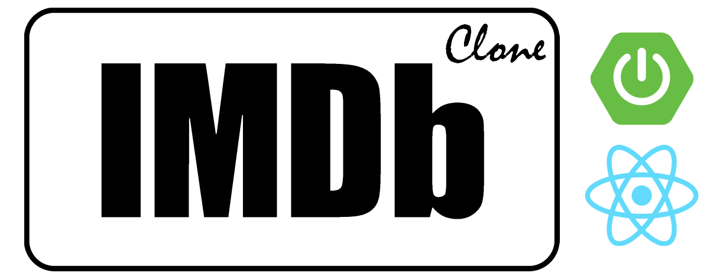

<p align="center">

<h3 align="center">This Project exemplifies a Real-World Java / React Web App.</h3>
<p>

---

<p id="Badges" align="center">
  <a href="https://github.com/NiklasTiede/IMDb-Clone/commits/master">
    
  </a>
  <a href="https://github.com/NiklasTiede/IMDb-Clone/issues">
    
  </a>
  <a>
    
  </a>
  <a>
    
  </a>
</p>

## Techstack
- Languages: Java JDK17 / Typescript
- Frameworks: Spring Boot / React (MaterialUI)
- Database: MySQL

## How to Run this Project from Source

You can either download the processed [Movie Dataset](https://www.dropbox.com/s/rzmhet4qf2joczz/processed_imdb_movies.csv?dl=0) 
by yourself and import it or go the easy way and pull/run the docker image I created for this purpose:

```bash
docker pull niklastiede/movie-db:latest
docker run --name niklastiede/movie-db -d --restart=always -p 3310:3306 niklastiede/movie-db --secure-file-priv=tmp
```

Now we can run our backend.

```bash
./gradlew clean bootRun
```

Lastly, we build up the frontend and serve it to `http://localhost:3000/`.

```bash
cd ./frontend
run build:moviesGen
npm run start
```

I also added a [Makefile](Makefile) as a little cheat sheet to refresh our memory for all the important commands 
we use during development.

### Todo:

- [x] Set up Database and import Movie Data
- [x] Create Java Backend 
- [ ] Create React Frontend
- [ ] Add CI, CD and Monitoring
