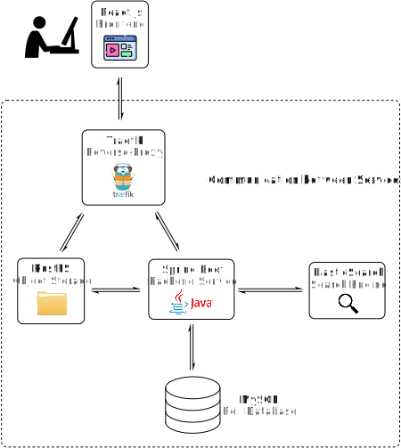

<p align="center">
  <a href="https://imdb-clone.the-coding-lab.com/" target="_blank">
    
  </a>

  <h3 align="center">This <a href="https://imdb-clone.the-coding-lab.com/" target="_blank">Project</a>  exemplifies a Real-World Java / React Web App running on Kubernetes.</h3>
</p>

---

<p align="center">

  <a href="https://stats.uptimerobot.com/5KMN7t0E5M">
    
  </a>
  <a href="https://github.com/NiklasTiede/IMDb-Clone/issues">
    
  </a>
  <a href="https://codecov.io/gh/NiklasTiede/imdb-clone" >
    
  </a>
  <a href="https://github.com/NiklasTiede/IMDb-Clone/commits/master">
    
  </a>
  <a>
    
  </a>
  <a>
    
  </a>
</p>

## Techstack
- Languages: Java 25 / TypeScript 6
- Frameworks: Spring Boot 4 / React 19 / Material UI 9
- Rel. Database: PostgreSQL 18
- SearchEngine: Elasticsearch 9
- File Storage: RustFS S3-compatible object storage
- Deployment: single-node k3s Kubernetes home server with Traefik ingress and cert-manager HTTPS
- Build / test tooling: Gradle 9.5.0 / Testcontainers 2

The app is secured with JWT authentication. The techstack is kept up-to-date. 

---

## Live Kubernetes Deployment

The application is deployed on a self-hosted single-node k3s Kubernetes cluster running on my home server. The cluster
runs the Spring Boot backend, React frontend, PostgreSQL, Elasticsearch, and RustFS object storage as Kubernetes
workloads. Public traffic is routed through Traefik ingress, HTTPS certificates are managed by cert-manager, and the
home router forwards ports `80` and `443` to the k3s node.

You can visit the live deployment here: [https://imdb-clone.the-coding-lab.com/](https://imdb-clone.the-coding-lab.com/).
The backend API and public object storage are exposed through dedicated subdomains for the Kubernetes deployment:

- Backend API: [https://backend.imdb-clone.the-coding-lab.com/](https://backend.imdb-clone.the-coding-lab.com/)
- Movie media: [https://object-storage.imdb-clone.the-coding-lab.com/](https://object-storage.imdb-clone.the-coding-lab.com/)

The Kubernetes manifests, GitOps setup, and home-cluster notes live in
[infrastructure/kubernetes](./infrastructure/kubernetes/README.md) and
[infrastructure/clusters/home](./infrastructure/clusters/home).

---

## Motivation

When entering the field of software engineering you need to learn how to build applications professionally.
You need to learn from good code bases (at best: similar to company code). There are the typical blog examples 
([here](https://github.com/gothinkster/realworld)) but what is about search functionality or the handling 
of images? How is the App deployed on a Kubernetes home server? How to generate client code with openapi-specifications?
How can I preload my App with data? The answer to all these questions and more can be found in this codebase.

The project can be rather easily rebuild locally (for a project of this size). If you want to explore a deployed 
instance of the IMDB Clone then visit [imdb-clone.the-coding-lab.com](https://imdb-clone.the-coding-lab.com/). 
Here's a diagram of the setup:

<p align="center">
  

<h4 align="center">Architecture Diagram showing the App's Service Interactions.</h4>
</p>

---

## How to Run this Project Locally

The production-like deployment runs on Kubernetes, while local development uses Docker Compose for the stateful
services. The backend does not create buckets, seed data, or rebuild Elasticsearch as a hidden startup side effect.
Local setup is explicit and repeatable:

1. Start PostgreSQL, Elasticsearch, and RustFS with Docker Compose.
2. Start the Spring Boot backend so Flyway creates the schema.
3. Seed local users, movies, and media.
4. Rebuild the Elasticsearch movie index.
5. Start the React frontend.

---

### 1. Set Up Stateful Services: PostgreSQL, Elasticsearch and Object Storage

At first, we have to run the with data preloaded stateful services (PostgreSQL, Elasticsearch and
RustFS object storage) which are used by the backend. I created a docker image of each service preloaded with 
data, so we just have to execute the `docker-compose.yaml`.

For more information on how data were collected, processed and imported look into 
the [infrastructure](./infrastructure/README.md)-folder.

### Seed Local Movie Data

Start PostgreSQL, RustFS, and Elasticsearch:

```bash
make docker-compose-dev-up
```

The Docker Compose setup includes a one-shot RustFS init container that creates
the `imdb-clone` bucket and makes `imdb-clone/movies/*` publicly readable.

Start the backend in another terminal and wait until it is ready:

```bash
./gradlew bootRun
```

Then load local demo users and the lightweight movie catalog:

```bash
make seed-local-users
make seed-light SEED_VERSION=2026-05-17
make reindex-local-search
```

The seed is idempotent, so rerunning it updates movies and media without wiping
user data. `seed-local-users` creates the local admin/user accounts, and
`reindex-local-search` rebuilds Elasticsearch from PostgreSQL.

--- 

### 1. Set Up Spring Boot Backend and Stateful Services: PostgreSQL, Elasticsearch and Object Storage

If the backend is not already running, start it with:

```shell
./gradlew build
./gradlew bootRun
```

This will automatically pull/start the stateful containers. So pulling might take time depending 
on your bandwidth. For more information on how data were collected, processed and imported look into
the [infrastructure](./infrastructure/README.md)-folder.

The backend can now be reached at port 8080 on localhost. You can test if the backend works properly by 
sending some http requests. Use the provided [.http](./src/main/resources/api-calls) files.

---

### 2. Set Up React Frontend

Now we can run the React frontend. We have to move into the frontend-folder and build & run with yarn or npm. 

```shell
cd ./frontend
yarn install
yarn run build:moviesGen
yarn start
```

The FE is served to `http://localhost:3000/`. We can search for movies and more.

I also added a [Makefile](Makefile) as a little cheat sheet to refresh our memory for all the important commands 
we use during development.
