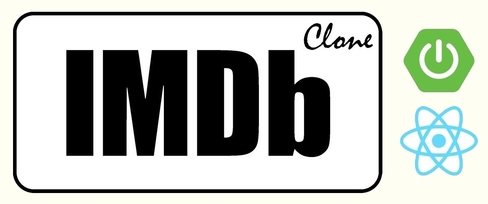
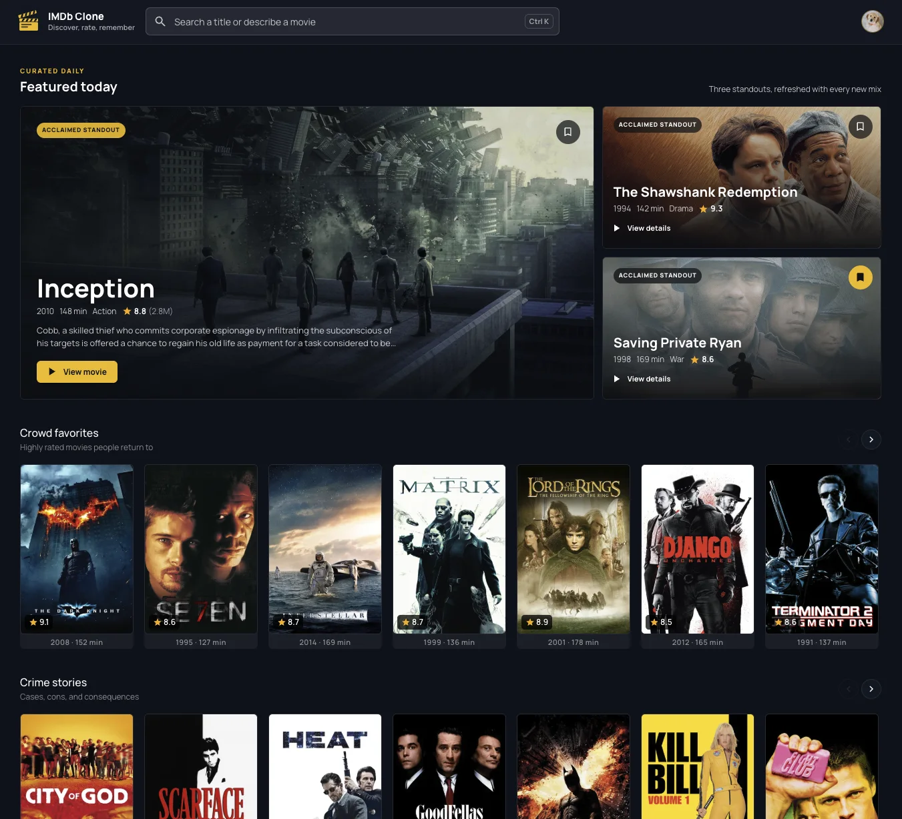
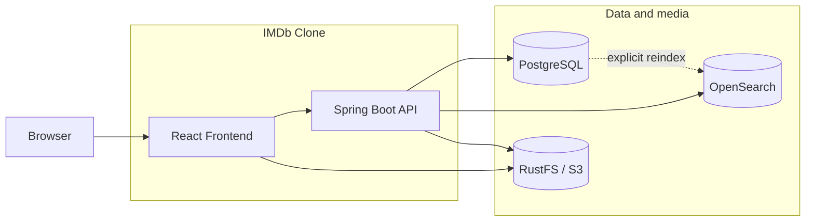
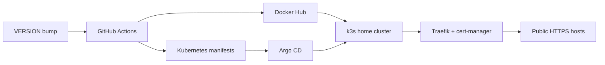

<p align="center">
  <a href="https://imdb-clone.the-coding-lab.com/" target="_blank">
    
  </a>
</p>

<h2 align="center">
  IMDb Clone - a production-style React + Spring Boot app with OpenSearch, object storage, and k3s GitOps.
</h2>

<p align="center">
  <a href="https://imdb-clone.the-coding-lab.com/" target="_blank">Live Demo</a>
  ·
  <a href="https://backend.imdb-clone.the-coding-lab.com/api/movie/1" target="_blank">Backend API</a>
  ·
  <a href="./infrastructure/kubernetes/README.md">Kubernetes Setup</a>
</p>

<p align="center">
  <a href="https://stats.uptimerobot.com/N4oJPO7A8b/794347971">
    
  </a>
  <a href="https://github.com/NiklasTiede/IMDb-Clone/actions/workflows/continuous-integration.yaml">
    
  </a>
  <a href="https://github.com/NiklasTiede/IMDb-Clone/blob/master/VERSION">
    
  </a>
  <a href="https://github.com/NiklasTiede/IMDb-Clone/issues">
    
  </a>
  <a href="https://codecov.io/gh/NiklasTiede/imdb-clone">
    
  </a>
  <a href="./LICENSE">
    
  </a>
</p>

<p align="center">
  <a href="https://imdb-clone.the-coding-lab.com/" target="_blank">
    
  </a>
</p>

## Overview

IMDb Clone is a full-stack movie catalog built as a production-style reference application. It goes beyond a CRUD demo:
movies are stored in PostgreSQL, searched through OpenSearch, served with poster and backdrop media from
S3-compatible object storage, and deployed to a self-hosted Kubernetes cluster through GitOps.

The project is intentionally kept close to a real web application architecture: generated API clients, explicit seed
data, JWT-based authentication, automated CI/CD, infrastructure manifests, and local developer workflows are all part of
the repository.

## What This Project Demonstrates

- Modular Spring Boot backend with PostgreSQL, Flyway, Spring Security, JWT auth, OpenAPI, and Testcontainers.
- React frontend with TypeScript, Material UI, TanStack Query, generated Axios clients, and feature-oriented structure.
- OpenSearch-backed movie search with PostgreSQL as the relational source of truth.
- S3-compatible media storage through RustFS for movie posters, backdrops, and profile images.
- Repeatable local development with Docker Compose, lightweight seed data, and explicit search reindexing.
- Self-hosted k3s deployment with Argo CD, Traefik ingress, cert-manager HTTPS, and encrypted GitOps secrets.
- Version-gated release workflow that builds Docker images and updates Kubernetes image digests from one `VERSION` file.

## Architecture

Runtime containers:


```mermaid
flowchart LR
  browser["Browser"]

  subgraph app["IMDb Clone"]
    frontend["React Frontend"]
    backend["Spring Boot API"]
  end

  subgraph data["Data and media"]
    postgres[("PostgreSQL")]
    opensearch[("OpenSearch")]
    rustfs[("RustFS / S3")]
  end

  browser --> frontend
  frontend --> backend
  frontend --> rustfs
  backend --> postgres
  backend --> opensearch
  backend --> rustfs
  postgres -. "explicit reindex" .-> opensearch
```

The backend owns the application domain and persists movie, identity, account, and engagement data in PostgreSQL.
OpenSearch is used as a derived search index and can be rebuilt explicitly from PostgreSQL. RustFS provides
S3-compatible object storage for public movie media and private account uploads. The React frontend talks to the backend
through generated API clients and loads public media through the object-storage host.

Delivery pipeline:


```mermaid
flowchart LR
  version["VERSION bump"]
  ci["GitHub Actions"]
  registry["Docker Hub"]
  manifests["Kubernetes manifests"]
  argocd["Argo CD"]
  cluster["k3s home cluster"]
  ingress["Traefik + cert-manager"]
  public["Public HTTPS hosts"]

  version --> ci
  ci --> registry
  ci --> manifests
  manifests --> argocd
  registry --> cluster
  argocd --> cluster
  cluster --> ingress
  ingress --> public
```

## Live Deployment

The public deployment runs on a Minisforum UM560 home server as a single-node k3s cluster.

- Frontend: [https://imdb-clone.the-coding-lab.com/](https://imdb-clone.the-coding-lab.com/)
- Backend API: [https://backend.imdb-clone.the-coding-lab.com/](https://backend.imdb-clone.the-coding-lab.com/)
- Movie media: [https://object-storage.imdb-clone.the-coding-lab.com/](https://object-storage.imdb-clone.the-coding-lab.com/)

Kubernetes manifests and home-cluster notes live in
[infrastructure/kubernetes](./infrastructure/kubernetes/README.md) and
[infrastructure/clusters/home](./infrastructure/clusters/home).

## Tech Stack

| Area | Technology |
| --- | --- |
| Backend | Java 25, Spring Boot 4, Spring Security, Spring Data JPA, Flyway |
| Frontend | React 19, TypeScript 6, Material UI 9, TanStack Query, Vite |
| Data | PostgreSQL 18, OpenSearch 3 |
| Media | RustFS, S3-compatible object storage, WebP poster/backdrop variants |
| API | OpenAPI spec, generated Axios client |
| Testing | JUnit, Spring Boot Test, Testcontainers, Vitest, React Testing Library |
| Delivery | Docker, GitHub Actions, k3s, Argo CD, Traefik, cert-manager, SOPS/age |

## Features

- Browse and search a seeded movie catalog with poster and backdrop media.
- View movie detail pages with metadata, ratings, trailers, and engagement data.
- Register and log in with JWT-backed authentication.
- Maintain account settings and profile images.
- Rate movies, write comments, and manage watched movies.
- Rebuild the OpenSearch index from PostgreSQL through an explicit admin flow.
- Seed local and production-like environments with versioned movie/media images.

## Run Locally

### Prerequisites

- Java 25
- Docker with Compose
- Node.js 24 and Yarn
- Make

The root [`Makefile`](./Makefile) is a command index for common workflows. It assumes these tools are installed
locally; you can check the local development prerequisites with:

```bash
make check-local-tools
```

Run `make help` to see all grouped targets.

### 1. Start Stateful Services

Start PostgreSQL, OpenSearch, and RustFS:

```bash
make docker-compose-dev-up
```

The Docker Compose setup includes a one-shot RustFS init container that creates the `imdb-clone` bucket and makes
`imdb-clone/movies/*` publicly readable.

### 2. Start The Backend

In a second terminal:

```bash
./gradlew bootRun
```

The backend runs on [http://localhost:8080](http://localhost:8080). Flyway creates the schema on startup.

### 3. Seed Demo Data

With the backend and Docker Compose services running:

```bash
make seed-local-users
make seed-light SEED_VERSION=2026-05-17
make reindex-local-search
```

The lightweight seed contains 250 movies and matching WebP media. The seed is idempotent, so rerunning it updates movie
and media rows without wiping local user data. The full seed pipeline can build larger datasets from IMDb and TMDB data;
details live in [infrastructure/movie-seed](./infrastructure/movie-seed/README.md).

### 4. Start The Frontend

In a third terminal:

```bash
cd frontend
yarn install
yarn run build:moviesGen
yarn start
```

The frontend runs on [http://localhost:3000](http://localhost:3000).

## Development Workflow

Detailed workflow docs:

- [Development Guide](./docs/development.md) for local setup, env vars, smoke checks, and troubleshooting.
- [Agentic Engineering](./docs/agents/README.md) for agent workflow, task templates, verification, and review.
- [Frontend Design System](./docs/design.md) for theme tokens, shared layout primitives, and UI consistency.
- [Agent Fast-Start](./AGENTS.md) for repo terminology, ownership, safety rules, and definition of done.

Useful commands from the repository root:

```bash
make help                            # list grouped workflow targets
./gradlew test                         # backend tests
./gradlew build jacocoTestReport       # backend CI-equivalent check
./gradlew spotlessApply                # format backend code
cd frontend && yarn build              # frontend production build
cd frontend && yarn test               # frontend tests
cd frontend && yarn run lint           # frontend linting
```

The frontend API client is generated from the backend OpenAPI spec. If backend contracts change, start the backend and
regenerate the client:

```bash
cd frontend
yarn run updateOpenApiSpec
yarn run build:moviesGen
```

Generated client files under `frontend/src/client/movies/generator-output` should not be edited manually.

## Release And Deployment

Application releases are controlled by the root [`VERSION`](./VERSION) file. A version bump on `master` triggers the CD
workflow, which:

1. runs backend and frontend checks,
2. builds Linux AMD64 backend and frontend Docker images,
3. pushes versioned images to Docker Hub,
4. resolves immutable image digests,
5. updates the home-cluster Kubernetes manifests,
6. lets Argo CD reconcile the live cluster from Git.

Infrastructure-only changes under `infrastructure/clusters/home` can be deployed through a normal push to `master`
without publishing new application images.

## Project Structure

```text
src/main/java/com/thecodinglab/imdbclone   Spring Boot backend modules
frontend/src                               React frontend source
compose.yaml                               Local Docker Compose services
infrastructure/clusters/home               k3s GitOps manifests
infrastructure/movie-seed                  Movie and media seed pipeline
```
