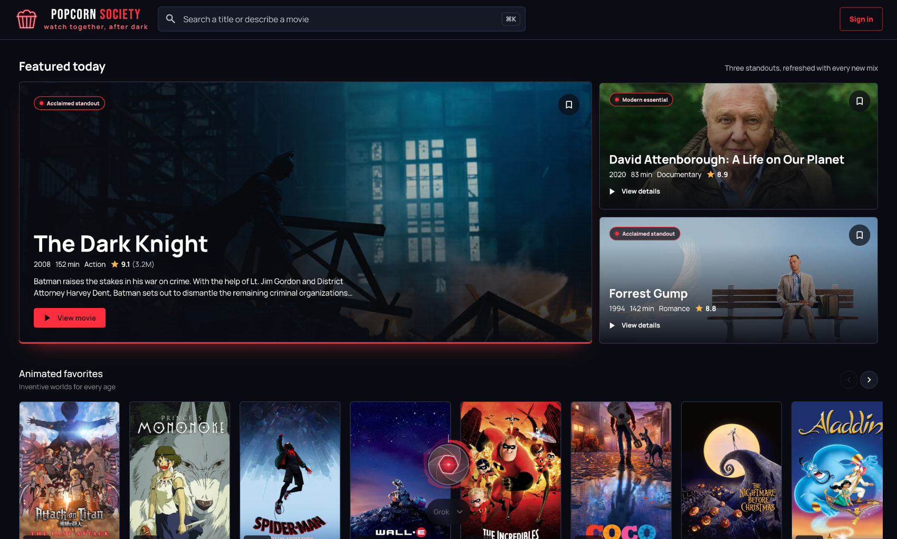
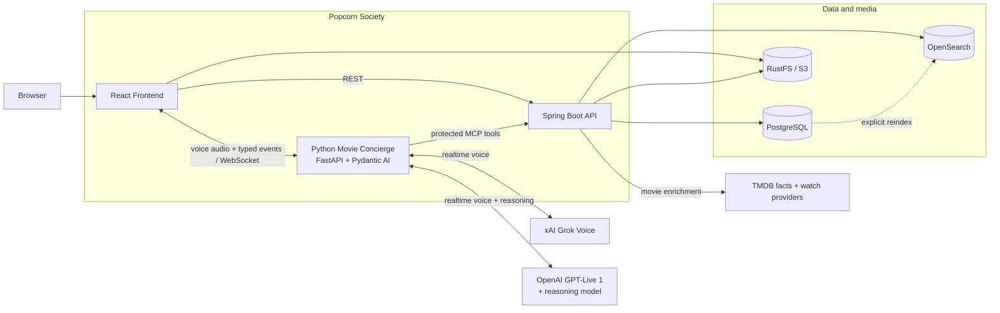
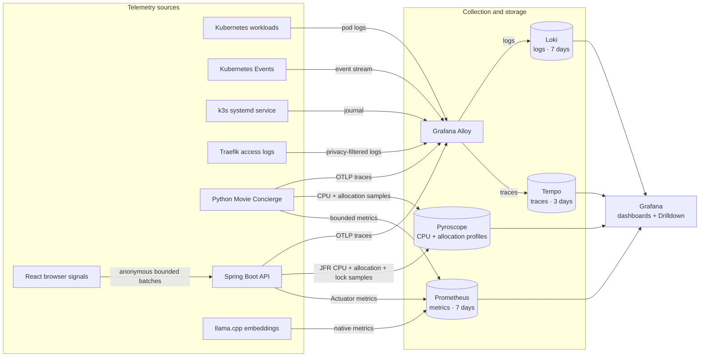
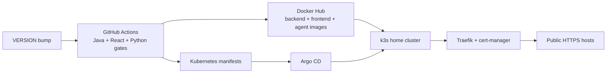

<p align="center">
  <a href="https://popcornsociety.app/" target="_blank">
    
  </a>
</p>

<p align="center">
  A voice-powered progressive web app for movie discovery.
</p>

<p align="center">
  <a href="https://popcornsociety.app/" target="_blank">Live Demo</a>
  ·
  <a href="https://docs.popcornsociety.app/architecture/">Interactive Architecture</a>
  ·
  <a href="./agent/README.md">Movie Concierge</a>
  ·
  <a href="./docs/operations.md">Operations</a>
</p>

<p align="center">
  <a href="https://stats.uptimerobot.com/N4oJPO7A8b/794347971">
    
  </a>
  <a href="https://github.com/NiklasTiede/popcorn-society/actions/workflows/continuous-integration.yaml">
    
  </a>
  <a href="https://github.com/NiklasTiede/popcorn-society/blob/master/VERSION">
    
  </a>
  <a href="https://github.com/NiklasTiede/popcorn-society/issues">
    
  </a>
  <a href="https://codecov.io/gh/NiklasTiede/popcorn-society">
    
  </a>
  <a href="./LICENSE">
    
  </a>
</p>

<p align="center">
  <a href="https://popcornsociety.app/" target="_blank">
    
  </a>
</p>

## Overview

Popcorn Society is a full-stack movie discovery application built and operated on a self-hosted
Kubernetes cluster. Browse the catalog yourself or explore it by speaking to the Movie Concierge:
find something to watch, open movie pages, and manage your personal movie library.

Previously called IMDb Clone. **[popcornsociety.app](https://popcornsociety.app/)** has been the
canonical production address since September 2026. The former public page URLs redirect to the
same paths on the new domain. See the [domain migration record](docs/popcorn-society-migration.md).

## Features

- **Discover movies:** browse a curated home feed, search by title or description, filter results,
  and compare similar movies or three explained Tonight Mode picks.
- **Explore by voice:** click the Voice Lens, allow microphone access, and speak in English.
  Choose Grok or GPT-Live 1; the lens responds visually while you speak and listen.
- **Navigate conversationally:** ask the Concierge to open a movie, show search results, or take you
  to your watchlist, ratings, settings, or the homepage. Ask what you can do on the current page.
- **Find trailers:** say “Show me the trailer for Forrest Gump” to open its movie page and center
  the trailer. Press Play to start the video.
- **Manage your library by voice:** when signed in, ask about your watchlist and highest-rated
  movies, add or remove watchlist entries, and set, change, or remove ratings. Get recommendations
  based on your previous ratings and taste.
- **Learn more and find where to watch:** ask for extra cast, crew, and production facts from TMDB,
  or streaming, rental, and purchase options from JustWatch via TMDB for your selected country
  (Switzerland by default). Availability depends on the data returned for that country.
- **Explore movie details:** view backdrops, metadata, ratings, trailers, similar titles, and
  community comments; share a movie with others.
- **Keep a personal profile:** sign in with a password, Google, GitHub, or a passkey; manage profile
  images, account settings, passkeys, ratings, watchlists, and comments. Review your rating insights
  and use the watchlist's three-choice decision helper.

The public Concierge experience is voice-first. Text history and developer controls are available
through the optional debug view; they are not the normal way to interact with the agent.

## Engineering Highlights

- **Clear ownership across services:** a modular Spring Boot domain backend, a React frontend
  organized by feature, and a separate Python agent. Java owns catalog data, recommendations, and
  personal actions; the agent accesses those capabilities through protected MCP tools.
- **Typed, bounded agent integration:** provider adapters, validated UI actions, delegated login,
  cancellation handling, and usage limits around realtime voice and tool execution.
- **Rebuildable data flows:** PostgreSQL as the source of truth, a derived OpenSearch index,
  S3-compatible media, and explicit, repeatable seed and reindex workflows.
- **Executable quality checks:** architecture rules, null/type checks, generated API contracts,
  integration tests, browser tests, and deterministic agent evals.
- **Observable delivery:** versioned container releases and reviewed GitOps updates to k3s, with
  metrics, logs, traces, browser performance signals, and continuous profiles for diagnosis.

## Architecture

Explore the [interactive architecture diagrams](https://docs.popcornsociety.app/architecture/)
for the application and observability stack, or visit the
[engineering documentation](https://docs.popcornsociety.app/) for an overview.

Application runtime:


```mermaid
flowchart LR
  browser["Browser"]
  grok["xAI Grok Voice"]
  openai["OpenAI GPT-Live 1<br/>+ reasoning model"]
  tmdb["TMDB facts + watch providers"]

  subgraph app["Popcorn Society"]
    frontend["React Frontend"]
    agent["Python Movie Concierge<br/>FastAPI + Pydantic AI"]
    backend["Spring Boot API"]
  end

  subgraph data["Data and media"]
    postgres[("PostgreSQL")]
    opensearch[("OpenSearch")]
    rustfs[("RustFS / S3")]
  end

  browser --> frontend
  frontend -- "REST" --> backend
  frontend <-->|"voice audio + typed events / WebSocket"| agent
  frontend --> rustfs
  agent <-->|"realtime voice"| grok
  agent <-->|"realtime voice + reasoning"| openai
  agent -- "protected MCP tools" --> backend
  backend --> postgres
  backend --> opensearch
  backend --> rustfs
  backend -- "movie enrichment" --> tmdb
  postgres -. "explicit reindex" .-> opensearch
```

The backend owns the application domain and persists movie, identity, account, and engagement data in PostgreSQL.
OpenSearch is used as a derived search index and can be rebuilt explicitly from PostgreSQL. RustFS provides
S3-compatible object storage for public movie media and private account uploads. The React frontend talks to the backend
through generated API clients and loads public media through the object-storage host. Voice audio travels over a
WebSocket through the Python service to the selected provider and back. Typed events let React navigate and refresh
the UI after Java confirms personal library changes. Python accesses Java-owned movie and personal capabilities only through protected
MCP tools; it never queries PostgreSQL or OpenSearch directly. Java also owns the TMDB integration.

Observability pipeline:


```mermaid
flowchart LR
  subgraph sources["Telemetry sources"]
    workloads["Kubernetes workloads"]
    events["Kubernetes Events"]
    k3s["k3s systemd service"]
    traefik["Traefik access logs"]
    frontendTelemetry["React browser signals"]
    agentTelemetry["Python Movie Concierge"]
    backendTelemetry["Spring Boot API"]
    llamaTelemetry["llama.cpp embeddings"]
  end

  subgraph stores["Collection and storage"]
    alloy["Grafana Alloy"]
    prometheus[("Prometheus<br/>metrics · 7 days")]
    loki[("Loki<br/>logs · 7 days")]
    tempo[("Tempo<br/>traces · 3 days")]
    pyroscope[("Pyroscope<br/>CPU + allocation profiles")]
  end

  grafana["Grafana<br/>dashboards + Drilldown"]

  workloads -- "pod logs" --> alloy
  events -- "event stream" --> alloy
  k3s -- "journal" --> alloy
  traefik -- "privacy-filtered logs" --> alloy
  frontendTelemetry -- "anonymous bounded batches" --> backendTelemetry
  agentTelemetry -- "OTLP traces" --> alloy
  backendTelemetry -- "OTLP traces" --> alloy
  agentTelemetry -- "CPU + allocation samples" --> pyroscope
  backendTelemetry -- "JFR CPU + allocation + lock samples" --> pyroscope
  alloy -- "logs" --> loki
  alloy -- "traces" --> tempo
  agentTelemetry -- "bounded metrics" --> prometheus
  backendTelemetry -- "Actuator metrics" --> prometheus
  llamaTelemetry -- "native metrics" --> prometheus
  prometheus --> grafana
  loki --> grafana
  tempo --> grafana
  pyroscope --> grafana
```

Alloy collects logs and privacy-safe Python/Java traces without storing them itself. Prometheus
scrapes bounded application, browser-experience, embedding, and cluster metrics. Browser telemetry
contains only fixed event categories, timings, Web Vital ratings, and coarse API outcomes—never
URLs, user/session IDs, error messages, stacks, or search text. Grafana provides the shared query
and dashboard surface over Prometheus, Loki, Tempo, and Pyroscope; the detailed retention, privacy,
and access contracts are documented in the [observability guide](./infrastructure/monitoring/README.md).

Delivery pipeline:


```mermaid
flowchart LR
  version["VERSION bump"]
  ci["GitHub Actions<br/>Java + React + Python gates"]
  registry["Docker Hub<br/>backend + frontend + agent images"]
  manifests["Kubernetes manifests"]
  argocd["Argo CD"]
  cluster["k3s home cluster"]
  ingress["Traefik + cert-manager"]
  public["Public HTTPS hosts"]

  version --> ci
  ci --> registry
  ci --> manifests
  manifests --> argocd
  registry --> cluster
  argocd --> cluster
  cluster --> ingress
  ingress --> public
```

## Live Deployment

[Try the application](https://popcornsociety.app/), hosted on a Minisforum UM560 home
server running a single-node k3s cluster. The public app includes both voice models.

Deployment manifests live in [infrastructure/clusters/home](./infrastructure/clusters/home).
Operator access and troubleshooting are documented in the
[production operations runbook](./docs/operations.md).

## Tech Stack

| Area | Technology |
| --- | --- |
| Backend | Java 25, Spring Boot 4, Spring Security, Spring Data JPA, Flyway |
| Frontend | React 19, TypeScript 6, Material UI 9, TanStack Query, Vite |
| Agent | Python 3.14, FastAPI, Pydantic AI 2.42, Pydantic Evals, uv, MCP, WebSocket voice |
| Data | PostgreSQL 18, OpenSearch 3 |
| Media | RustFS, S3-compatible object storage, WebP poster/backdrop variants |
| API | OpenAPI spec, generated Axios client |
| Authentication | Spring Session JDBC, CSRF, password login, Google/GitHub OAuth2, WebAuthn passkeys |
| Testing | JUnit, Spring Boot Test, Testcontainers, jqwik, JaCoCo, Vitest, React Testing Library, Playwright |
| Build safety | Error Prone, NullAway/JSpecify, strict TypeScript, typed ESLint, API-contract drift checks |
| Delivery | Docker, GitHub Actions, k3s, Argo CD, Traefik, cert-manager, SOPS/age |
| Observability | OpenTelemetry, Grafana Alloy, Prometheus, Loki, Tempo, Pyroscope, Grafana |

## Run Locally

### Prerequisites

- Java 25
- Docker with Compose
- Node.js 24 and Yarn
- Python 3.14 and uv for the Movie Concierge
- Make

The root [`Makefile`](./Makefile) is a command index for common workflows. It assumes these tools are installed
locally; you can check the local development prerequisites with:

```bash
make check-local-tools
```

Run `make help` to see all grouped targets.

### 1. Start Stateful Services

Start PostgreSQL, OpenSearch, and RustFS:

```bash
make docker-compose-dev-up
```

The Docker Compose setup includes a health-checked RustFS initialization helper that creates the `imdb-clone` bucket and makes
`imdb-clone/movies/*` publicly readable.

### 2. Start The Backend

In a second terminal:

```bash
./gradlew bootRun
```

The backend runs on [http://localhost:8080](http://localhost:8080). Flyway creates the schema on startup.

### 3. Seed Demo Data

With the backend and Docker Compose services running:

```bash
make seed-local-users
make seed-light SEED_VERSION=2026-05-17
make reindex-local-search
```

The lightweight seed contains 250 movies and matching WebP media. The seed is idempotent, so rerunning it updates movie
and media rows without wiping local user data. The full seed pipeline can build larger datasets from IMDb and TMDB data;
details live in [infrastructure/movie-seed](./infrastructure/movie-seed/README.md).

### 4. Start The Frontend

In a third terminal:

```bash
cd frontend
yarn install
yarn run build:moviesGen
yarn start
```

The frontend runs on [http://localhost:3000](http://localhost:3000).

### 5. Start The Movie Concierge

For local voice with both Grok and GPT-Live 1 enabled:

```bash
make agent-sync
make run-agent-voice-compare
```

Voice needs provider credentials and access to the running Java backend's MCP tools. Follow the
[Movie Concierge setup guide](./agent/README.md) for the ignored local credential files, model
configuration, and microphone permissions. `make run-agent-voice` enables Grok only. Never commit keys.

For deterministic text/debug UI work without Java or provider credentials, use `make run-agent-fake`
and open `http://localhost:3000/?conciergeDebug=1`. This fake backend does not simulate live speech;
automated voice browser tests use synthetic audio and intercepted WebSocket responses.

## Development Workflow

Detailed workflow docs:

- [REST API Contract](./docs/rest-api.md) for versioning, resource paths, authorization, and recovery flows.
- [Development Guide](./docs/development.md) for local setup, env vars, smoke checks, and troubleshooting.
- [Movie Concierge](./agent/README.md) for Python setup, runtime contracts, evals, and production guardrails.
- [Movie Concierge Architecture](./docs/movie-concierge.md) for the accepted product and trust boundaries.
- [Movie Concierge Roadmap](./docs/movie-concierge-roadmap.md) for capabilities, personal actions,
  external knowledge, safety, scaling, and voice milestones.
- [Production Operations](./docs/operations.md) for URLs, private tunnels, DBeaver, logs, traces, and incidents.
- [Agentic Engineering](./docs/agents/README.md) for agent workflow, task templates, verification, and review.
- [Left-Shift Engineering Roadmap](./docs/left-shift-engineering.md) for planned compiler, type, test, and agent-feedback experiments.
- [Frontend Design System](./docs/design.md) for theme tokens, shared layout primitives, and UI consistency.
- [Product Roadmap](./docs/product-roadmap.md) for the long-term movie detail and discovery vision.
- [Agent Fast-Start](./AGENTS.md) for repo terminology, ownership, safety rules, and definition of done.

Useful commands from the repository root:

```bash
make help                            # list grouped workflow targets
./gradlew test                         # fast backend tests
./gradlew integrationTest              # backend integration tests
./gradlew build jacocoTestReport       # backend CI-equivalent check
./gradlew spotlessApply                # format backend code
cd frontend && yarn typecheck          # browser, Vite, and Playwright TypeScript checks
cd frontend && yarn lint:fast           # native lint and type feedback during development
cd frontend && yarn lint                # full Oxlint and ESLint gate
cd frontend && yarn test               # frontend unit and component tests
cd frontend && yarn build              # frontend production build
make verify-agent                      # Python formatting, types, architecture, tests, and deterministic evals
make verify-observability-charts       # render Loki, Tempo, Pyroscope, and Alloy; validate Alloy configuration
make verify-kubernetes-schema          # render and validate the complete home-cluster GitOps tree
```

The frontend API client is generated from the backend OpenAPI spec. If backend contracts change, start the backend and
regenerate the client:

```bash
cd frontend
yarn run updateOpenApiSpec
yarn run build:moviesGen
```

Generated client files under `frontend/src/client/movies/generator-output` should not be edited manually.
CI also compares the backend's runtime OpenAPI document with the checked-in frontend specification, ignoring only the
environment-specific server URL, so contract drift fails before client generation can silently use stale types.

## Release And Deployment

Pull requests targeting `master` and merge queue candidates run backend, frontend, agent, and infrastructure
checks. CI also supports manual runs; it does not repeat the full suite on every merged `master` commit.
Application releases are controlled by the root [`VERSION`](./VERSION) file. A version bump merged to `master` triggers the CD workflow, which:

1. runs backend, frontend, and deterministic agent checks,
2. builds Linux AMD64 backend, frontend, and agent Docker images,
3. pushes versioned images to Docker Hub,
4. resolves immutable image digests,
5. updates the home-cluster Kubernetes manifests on a dedicated release branch,
6. opens a deployment pull request containing the three immutable image digests,
7. lets Argo CD reconcile the live cluster only after that pull request passes CI and is merged.

Infrastructure-only changes under `infrastructure/clusters/home` can be deployed through a normal reviewed pull
request without publishing new application images.

## Project Structure

```text
src/main/java/app/popcornsociety   Spring Boot backend modules
frontend/src                               React frontend source
agent/src/popcorn_society_agent                       Python Movie Concierge modules
compose.yaml                               Local Docker Compose services
infrastructure/clusters/home               k3s GitOps manifests
infrastructure/movie-seed                  Movie and media seed pipeline
docs/operations.md                         Production access and incident runbook
```
