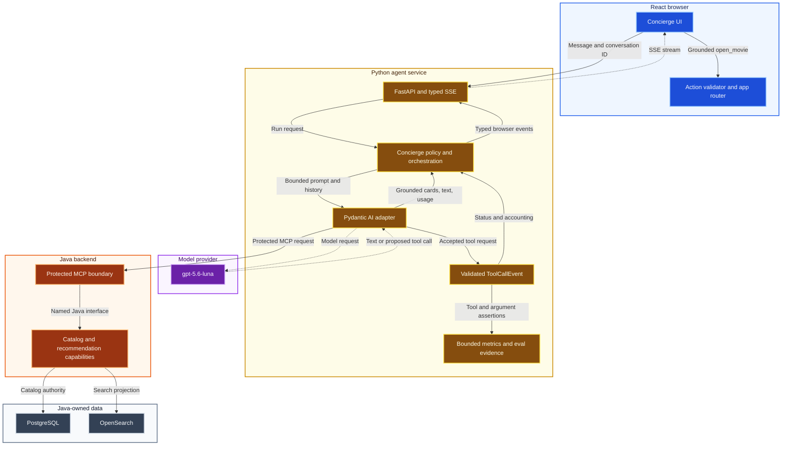
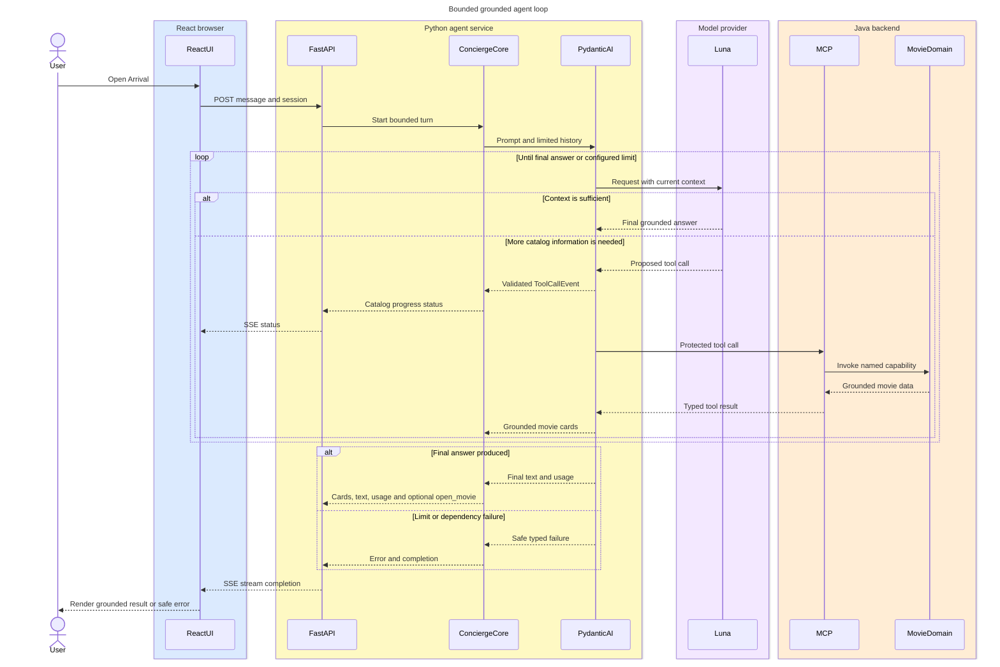

# IMDb Clone Movie Concierge

Production read-only pilot for conversational discovery in the IMDb Clone. It uses Pydantic AI
2.42.0 with `gpt-5.6-luna`, calls the Java domain through protected MCP tools, and streams an
application-owned event contract to React.

The accepted product and trust boundaries live in
[`docs/movie-concierge.md`](../docs/movie-concierge.md). Ordered work toward personal actions,
external enrichment, durable scale, and voice lives in the
[`Movie Concierge long-term roadmap`](../docs/movie-concierge-roadmap.md). This README documents
only the currently implemented runtime.

## How the agent works

The Movie Concierge is more than the language model. React owns the user experience, the Python
service owns orchestration and safety policy, the model provider proposes text and tool calls, and
Java remains the authority for movie data and recommendations. The colors below mark those system
and trust boundaries; notably, Python and the model provider have no direct data-store access.



A grounded request such as **“Open Arrival”** runs through a bounded agent loop. On every model
request, Luna decides whether the current context is sufficient for a final answer or whether it
needs one or more Java-owned tools. Pydantic AI validates proposed calls structurally, executes
accepted calls through MCP, and adds their typed results to the next model request. The loop stops
on a final answer, a safe failure, or a configured request, tool, token, time, or cost limit.



The model therefore chooses the next semantic step, but it does not control the loop without
limits. The current production defaults allow at most four model requests and six tool calls in a
30-second run, alongside input/output-token and per-run cost limits. Even after a successful model
answer, the provider-independent Concierge policy emits `open_movie` only when the current run has
resolved exactly one matching grounded movie; the model cannot supply a URL or route.

## Local setup

Create the locked Python 3.14 environment:

```bash
make agent-sync
```

For the Luna runtime, copy the safe template and edit only the ignored destination:

```bash
mkdir -p .secrets
cp agent/movie-concierge.local.env.example .secrets/movie-concierge.local.env
chmod 600 .secrets/movie-concierge.local.env
```

The only supported local credential field is `OPENAI_API_KEY`. The service reads it directly from
`.secrets/movie-concierge.local.env`; it does not read a shell `OPENAI_API_KEY` or a working-directory
dotenv file. Never print, source, log, screenshot, or commit the secret file. Configure a $20 hard
project budget in the OpenAI dashboard as the authoritative cross-process spending limit.

Start PostgreSQL/OpenSearch/RustFS, the Java backend, the Python service, and Vite in separate
terminals:

```bash
make docker-compose-dev-up
./gradlew bootRun
make run-agent
cd frontend && yarn start
```

Vite proxies `/concierge-api` to `http://localhost:8090`. The Java MCP endpoint is
`http://localhost:8080/mcp` and uses the local development workload token from the checked-in dev
configuration.

For UI development without Java or a provider key:

```bash
make run-agent-fake
```

The fake backend is explicit and deterministic. The normal `make run-agent` path defaults to Luna
and fails safely when the dedicated key file is absent or invalid.

## Contract and safety

The browser creates a server conversation, then POSTs messages and consumes typed server-sent
events:

- `status` — bounded user-visible progress, never private reasoning;
- `text` — incremental answer text;
- `movie-card` — a Java-tool-grounded movie projection;
- `ui-action` — a strictly typed `open_movie` action containing only a grounded catalog movie ID;
- `error` — redacted stable code, safe message, and retryability;
- `usage` — requests, tool calls, input/cache/output tokens, and estimated USD cost;
- `completion` — terminal outcome and conversation identifier.

Conversation state is process-local, bounded, isolated by a browser/account client identifier, and
intentionally cleared on Python restart. Only one turn may run per conversation. Disconnects cancel
the downstream run. Model requests are bounded by time, concurrency, request, tool-call, token,
per-run cost, and process budget limits.

Movie facts are accepted only from four Java-owned tools:

- `search_movies`
- `get_movie_details`
- `get_similar_movies`
- `get_tonight_picks`

Python never reads PostgreSQL or OpenSearch. Account mutations, web search, long-term memory, and
voice are outside the current read-only release.

The model runner cannot emit UI actions directly. After a successful run, provider-independent
policy requires explicit open intent, one uniquely resolved current-run movie, and a matching
title, catalog ID, or unambiguous reference. React validates the strict action, requires the
matching card to have appeared earlier in the same stream, and builds `/movie?id=...` through an
app-owned route helper. URLs, routes, stale conversation cards, tool failures, and ambiguous results
never navigate.

## Evals and verification

Run the deterministic 27-case suite and complete agent gate without a key or network:

```bash
make eval-agent
make verify-agent
```

The dataset covers normal, ambiguous, adversarial, tool-error, grounding, constraint-refinement,
budget, UI-action, and unsupported-mutation behavior. Pydantic Evals checks required/allowed tools,
important arguments, required and forbidden text terms, exact safe error codes, catalog identifier
and UI-action grounding, and run bounds. Qualitative `review_criteria` and `review_risks` remain
explicitly human-reviewed rather than pretending to be executable assertions. Deterministic
scenarios and movie fixtures live in the dataset, so extending it does not require adding case-ID
branches to Python. Fault-injection-only cases remain deterministic.

The Pydantic AI Adapter translates every framework-validated tool call into an internal,
provider-neutral `ToolCallEvent`. The Concierge uses that single event for user-visible status and
bounded metrics, while the eval harness uses it for tool and argument assertions. Internal tool
arguments are never part of the browser SSE contract, logs, traces, or Prometheus labels.

Live evals require two deliberate controls and are never part of CI:

```bash
IMDB_AGENT_LIVE_EVALS_ENABLED=true \
  make eval-agent-live AGENT_EVAL_CASE=exact-title-search
```

The live path uses the same dedicated secret file, Luna limits, and Java MCP service. Start with one
case and inspect usage before expanding the selection.

Container verification stays keyless by selecting the fake backend:

```bash
make docker-build-agent
make container-smoke-agent
```

## Production pilot contract

The home-cluster pilot remains a single process with bounded, in-memory conversation state. It
stores at most 500 conversations, evicts the least-recently-used inactive session at that bound,
and intentionally loses all history on restart. Deployments use `Recreate` so two independent
session and budget ledgers never overlap; a rollout therefore has a short controlled unavailability
window. There is no agent database or user-specific data.

Production credentials come only from the SOPS-encrypted `movie-concierge-runtime` Kubernetes
Secret. Kubernetes projects two read-only files under `/run/secrets/movie-concierge`:

- `openai-api-key` for the provider Adapter;
- `mcp-bearer-token` for the protected Java workload boundary.

The Java backend receives only the MCP file, never the OpenAI credential. Production startup fails
with a redacted configuration error when either projected file is missing, invalid, or accessible
to other Unix users. Local startup continues to use the exact ignored dotenv path documented above.
Neither mode accepts an `OPENAI_API_KEY` environment variable.

The public browser contract is same-origin at `/concierge-api/v1`. Traefik strips only the
`/concierge-api` prefix and applies a dedicated per-source rate limit plus a four-request global
in-flight limit. `/healthz`, `/readyz`, and `/metrics` are not public ingress paths. The application
also enforces:

- a 4 KiB request-body limit before FastAPI parses the body;
- 600 characters per message and strict typed request models;
- two active agent runs, rejected immediately rather than queued when saturated;
- four model requests, six tool calls, 24,000 input tokens, 1,500 output tokens, 30 seconds, and
  $0.25 per run;
- a $20 process budget as a final local guard, with the provider project cap remaining authoritative
  across restarts.

The input-token limit is cumulative across model requests, including repeated tool schemas and
cached input. A live catalog lookup followed by TMDB enrichment used about 17,000 input tokens
across three model requests; the 24,000-token allowance supports that normal tool chain.

Prometheus collects bounded HTTP, run, outcome, first-event latency, tool, UI-action decision,
token, provider-estimated cost, process-budget, saturation, and disconnect metrics. The
`IMDb Clone / Movie Concierge` Grafana dashboard visualizes those signals. PrometheusRules cover
availability, errors, latency,
MCP/provider failures, capacity, and cost. Alertmanager is deliberately not installed yet, so rules
are visible in Prometheus/Grafana but do not send notifications.

Production also exports one OpenTelemetry trace per sampled HTTP/agent run through the internal
Alloy OTLP endpoint to Tempo. Pydantic AI contributes child spans for model requests and tool calls;
HTTPX propagates W3C trace context across the protected MCP request, and Spring Boot continues the
trace in Java. `InstrumentationSettings` disables prompts, completions, binary content, tool
arguments/results, and serialized model request parameters. FastAPI instrumentation does not
capture request or response bodies; it replaces concrete conversation paths, query strings, client
addresses, ports, and user agents with bounded route metadata. Agent logs add `trace_id` and
`span_id` only while a valid span is active, allowing Grafana to move between Loki logs and Tempo
traces.

Production also enables continuous profiling against the private Pyroscope service. The Python
runtime samples CPU at 50 Hz and allocations at an average 512 KiB interval, uploading every 15
seconds. It does not attach PID, thread identity, prompts, request data, conversation identifiers,
or tool content. `pyroscope-otel` associates root OpenTelemetry spans with profile samples so
Grafana can move from a trace to the relevant CPU profile. Profiling is disabled by default outside
production and initialization/export failures do not break concierge requests. Production defaults
to the cluster-local endpoint so the manifest stays compatible with the previously published agent
image during the two-step image release; `IMDB_AGENT_PROFILING_ENABLED=false` is the kill switch.

Allocation profiles show which stacks allocate memory; they are not a retained-heap measurement.
Use Prometheus process metrics to answer how much memory the pod currently consumes.

The agent samples all traces during this low-volume pilot. Tempo retains them for three days and
Loki retains structured logs for seven days. Tempo, Loki, and Pyroscope remain cluster-internal;
see [`docs/operations.md`](../docs/operations.md) for private operator access.

Validate the complete production contract without deploying:

```bash
make verify-agent
make docker-build-agent
make container-smoke-agent
make verify-movie-concierge-production
make verify-observability-production
make verify-observability-charts
make verify-kubernetes-schema
```

Do not apply these manifests directly. The version-gated release workflow builds all three app
images, pins their Docker digests, and updates the existing GitOps tree after an intentional
`VERSION` release.

## Local application voice

Start the Java backend and frontend as usual, then run `make run-agent-voice` from the
repository root instead of `make run-agent`. The separate
`.secrets/movie-concierge-voice.local.env` must contain `XAI_API_KEY`; the existing text
configuration and MCP workload token are still used. Do not start two agents on port 8090.

Open `http://localhost:3000`, open Movie Concierge and select **Start voice**. Grant microphone
permission, speak English, and try “Find Forrest Gump and open its movie page”, or ask about it
first and then say “Open it”. The provider uses server VAD; no send button is required. The
microphone waveform and assistant waveform use actual captured/playback levels. Film navigation
minimizes the panel into a persistent dock. Mute affects input only; Interrupt stops reply playback
and requests provider cancellation; End stops capture, playback and the WebSocket. Identity
changes dispose the complete voice owner. The local slice now supports delegated watchlist reads
and explicit additions/removals plus personal rating set/update/removal for signed-in users; see ADR 0004.

On macOS, allow the browser under **System Settings → Privacy & Security → Microphone** as well
as in the browser's site permissions. Use localhost or HTTPS. If access is denied, the UI offers
retry and retains the existing text conversation. No audio is acquired merely by opening the panel.

This initial rollout is explicitly **local only**, off unless `IMDB_AGENT_VOICE_ENABLED=true`.
Production rejects that setting until public voice admission and rollout validation are complete. WebSocket origins default to localhost/127.0.0.1 port 3000. Limits are two concurrent
connections, 180 seconds per session, 45 seconds without speech, 20 attempted sessions per process,
32 model requests, 24 tools, bounded PCM/control frames and input/output queues. The session and
process limits are configurable within bounded settings. No automatic reconnect is attempted.
These are resource limits, not a guaranteed USD budget; voice billing is provider-owned.
The browser buffers up to 60 seconds of queued reply audio, including each incoming chunk,
because generated speech can arrive faster than playback. Interrupt and End discard that queue.
Browser regression tests deliver a 22.5-second audio burst to cover this case.
Playback starts with 300 ms of lead to absorb delivery jitter, then joins chunks without adding
per-chunk delays. A `reply-complete` event marks the end of generation; controls remain available
until that event and the queued audio have both finished, including across temporary underruns.
Interrupt clears both the playback queue and pending-reply state immediately.

The browser sends 24 kHz mono PCM16 binary frames and a strict interrupt/mute/resume/end control
vocabulary to `/v1/voice`. Python owns the xAI session and allowlisted Java MCP tools. Signed-in sessions additionally
expose watchlist read/add/remove and personal rating set/remove; the application-only identity tool is never exposed to the model.
Only final speech plus validated, session-owned catalog evidence may trigger an `open_movie`
action; React constructs the route and checks same-turn evidence and duplicate suppression again.
Unconditional commands such as “Open Forrest Gump” and “Open it” navigate as soon as the final
transcript and one matching grounded movie are available, without waiting for the spoken reply.
Current-turn tool calls must have returned first. Conditional/compound requests use the existing
completed-turn path; ambiguous results and cancelled turns cannot take the fast path.
Audio and transcripts are ephemeral and excluded from application telemetry. The xAI session uses
`transcript_only` retention; no microphone recordings or transcripts are written to disk.

Opt-in synthetic application replay (one billable session per invocation, at most 55 seconds):

```bash
cd agent
IMDB_AGENT_LIVE_EVALS_ENABLED=true uv run python evals/voice/replay_session.py --live
IMDB_AGENT_LIVE_EVALS_ENABLED=true uv run python evals/voice/replay_session.py --live --scenario context
```

This checks real Java-backed Forrest Gump results, audio and grounded navigation. Unlike the
compatibility probe, it requires the local application stack and a catalog containing the movie.
It overwrites only `application-open` and `application-context` JSON/WAV pairs in the ignored
`.artifacts/voice-probe` directory. Output is synthetic fixture replay only, with no raw transcript
in reports. Reports measure navigation independently from reply completion, including time since
the server's detected speech end and since grounded evidence arrived. These are diagnostic samples,
not latency guarantees. Browser tests separately exercise real AudioWorklet capture and playback against a
deterministic WebSocket; neither automated layer proves physical microphone quality.

## Local Grok voice compatibility probe

The first voice slice is a local development CLI, not a microphone feature in the deployed app.
It uses Pydantic AI 2.42.0 with the `xai-realtime` extra and pins
`grok-voice-think-fast-2.0`. The text runner and its OpenAI configuration remain independent.

Store `XAI_API_KEY` in the repository-root `.secrets/movie-concierge-voice.local.env`.
This file is ignored by Git and read only by the explicit voice probe. Its loader accepts only
that field, does not interpolate environment variables, and redacts validation failures.
Do not add it to the existing OpenAI secret file or frontend environment.

From the repository root:

```bash
make agent-sync
IMDB_AGENT_LIVE_EVALS_ENABLED=true make probe-agent-voice-live
IMDB_AGENT_LIVE_EVALS_ENABLED=true make probe-agent-voice-interrupt-live
```

Each command permits **one billable provider session**, with no automatic retry/reconnect:
45 seconds including connection setup, at most 15 seconds of input, 20 seconds of collected
output, three model requests and two successful tool calls. Model settings cap each response
at 512 tokens; cumulative token limits are checked when usage arrives. The session deadline
and audio bounds apply independently of provider cost reporting. This is not a guaranteed USD
spending cap: `estimated_cost_usd: null` means no estimate is available, not zero cost.

The fixed [synthetic fixture](evals/voice/README.md) tests a simulated Forrest Gump lookup and a spoken
English answer. Voice development initially uses English commands, responses and catalog titles;
German dialogue is deferred, and movie titles must not be translated before catalog lookup.
The CLI exits nonzero for failed assertions, provider failures or limits. It emits
only a content-free JSON report; SDK logs and agent instrumentation are disabled. No key, raw
transcript, provider frame or tool argument is printed.

Successful execution writes reports and playable WAV files under the Git-ignored
`agent/.artifacts/voice-probe/`: `completed.json/.wav` and `interrupted.json/.wav`. Each scenario
overwrites its previous result, bounding retention to the latest two runs; these local synthetic
artifacts persist until overwritten or manually removed. Failed execution may leave the previous
run's files in place: use the command exit status, not an old artifact, to judge the current run.
No production transcripts or microphone recordings belong in this directory.

On macOS, listen with:

```bash
afplay agent/.artifacts/voice-probe/completed.wav
```

See [ADR 0003](../docs/adr/0003-movie-concierge-voice-probe.md) for the channel boundary and limits.

## Package map

```text
src/imdb_agent/
├── concierge/    provider-independent policy, tools, events, eval contract, ports, orchestration
├── web/          FastAPI and typed SSE inbound adapter
├── adapters/     Pydantic AI/OpenAI/MCP, memory, eval, logging, metrics, and fakes
├── bootstrap.py  composition root
└── settings.py   validated non-secret settings and environment-specific secret-file loading
```

See [`AGENTS.md`](AGENTS.md) for Python-specific architecture rules,
[`docs/movie-concierge.md`](../docs/movie-concierge.md) for product boundaries, and the
[`long-term roadmap`](../docs/movie-concierge-roadmap.md) for ordered capability work.


## Local delegated watchlist (text and voice)

Sign in normally, then ask `Show my watchlist` or `Add Forrest Gump to my watchlist and show it`.
The existing watchlist page opens after a confirmed result and refreshes its cached data. A receipt
notification offers Undo for a newly added movie; already-listed films are reported as such.
An ambiguous title needs its year; `add it` requires one unambiguous catalog candidate.

The browser obtains a five-minute capability from `POST /api/v1/auth/concierge-delegation` using
normal session cookies and CSRF protection. It is held only for the request/session, never in URLs
or browser storage. Text forwards it in `X-Concierge-Delegation`; voice sends a first frame
`{"type":"start","delegation":null}` for anonymous sessions, or supplies the transient capability
in that field when signed in. Audio starts after `ready`. Old clients must reload for this handshake.

Java independently verifies the login session, expiry, audience and scope for every personal tool.
Python never selects the account. The agent can remove a named watchlist entry and set/update/remove a personal rating.
For example: `Remove Forrest Gump from my watchlist`, `Rate Forrest Gump 8.5 out of 10`,
`Change my rating for Forrest Gump to 9`, or `Remove my rating for Forrest Gump`.
Ratings open `/your-ratings`; both pages refresh after confirmed success. Undo restores the
previous membership or score. Missing scores, ambiguous titles and unsupported scales require
a clearer command. Rating/taste reads are not yet available. Read
[ADR 0004](../docs/adr/0004-concierge-session-delegation-and-watchlist.md) for authorization,
conversation isolation, idempotency, retention and threat analysis. This is local implementation,
not evidence of a public voice rollout.
