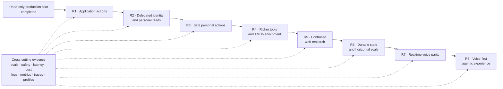

# Movie Concierge Long-Term Roadmap

**Status:** Living delivery roadmap

**Last updated:** 2026-08-25

**Current focus:** Application actions, delegated user capabilities, and richer grounded tools

This roadmap turns the accepted [Movie Concierge product vision](movie-concierge.md) into ordered,
independently releasable outcomes. It is not a release commitment. Each milestone must become a
small implementation plan before code changes begin, and completed behavior belongs in release
notes rather than an ever-growing checklist.

The load-bearing architecture remains in
[ADR 0001](adr/0001-movie-concierge-architecture.md). New ADRs are required before changing durable
trust, state, provider, or transport decisions.

## North-Star Experience

The target experience is a fast, voice-first movie companion that can explain its capabilities,
understand an entertainment goal, use trusted application and external knowledge, act for an
authenticated user, and move the existing React application to the useful result.

A representative journey is:

1. The user starts voice control and asks, “What can you do for me?”
2. The Concierge describes only the capabilities available to this user and this release.
3. The user asks for a short, thoughtful science-fiction movie available tonight and related to
   movies they already like.
4. The Concierge combines Java-owned catalog, recommendation, and account capabilities with
   attributed external enrichment where needed.
5. It asks a clarification only when the missing preference materially changes the result.
6. The user says, “Add the best one to my watchlist and open it.”
7. The authorized, retry-safe watchlist action succeeds and the React application opens the
   grounded movie page.
8. The user says, “Now show my watchlist,” and React navigates there without opening a parallel
   agent-owned user interface.

The Concierge succeeds only when the user reaches this outcome safely, accurately, and with useful
latency. Fluent text alone is not success.

## Current Baseline

The production pilot already provides:

- a public text Concierge deployed as a separate Python process;
- four protected Java MCP tools for search, details, similar movies, and Tonight Mode;
- bounded model/tool loops, timeouts, cancellation, usage and cost limits;
- typed streaming events, grounded movie cards, capability discovery, and safe `open_movie`
  actions;
- bounded process-local conversation state with deterministic fakes and a versioned eval dataset;
- metrics, logs, traces, continuous profiles, dashboards, alerts, and cross-runtime trace
  propagation;
- architecture checks that keep product policy independent of Pydantic AI and provider types.

Intentional limitations remain:

- account state is not delegated to Python, so current tools expose only public read-only domain
  behavior;
- conversation and budget state are process local, one replica is used, and restarts clear history;
- external movie data and unrestricted web research are not part of the grounded knowledge path;
- voice is not an interaction channel yet;
- current evals provide a deterministic baseline but not yet a full production promotion gate with
  traffic-derived quality and latency thresholds.

## Architectural Invariants

These rules apply to every roadmap milestone:

1. **Java owns domain decisions.** Movie, Account, Watchlist, Rating, Search Index, Recommendation,
   authorization, and mutations remain in their Java modules. Python uses narrow MCP Interfaces and
   never queries their PostgreSQL or OpenSearch implementations directly.
2. **Python owns orchestration policy.** The Concierge product Module coordinates model calls,
   tools, approvals, bounded conversation state, and provider-independent events. Provider and
   framework details remain behind Adapter seams.
3. **React owns application navigation and rendering.** The model emits semantic, typed actions—not
   URLs, routes, or arbitrary user-interface definitions. React validates actions and maps them to
   known destinations.
4. **The model is not an authority.** Identifiers, account identity, permissions, facts, and write
   authorization are validated outside the model. Tool results and external content are data, not
   instructions.
5. **Interaction channels are replaceable.** Text, realtime voice, and future external agents reuse
   the same capability, authorization, approval, action, and eval Interfaces.
6. **Telemetry is privacy safe.** Production metrics remain bounded; logs and traces exclude raw
   prompts, secrets, authorization material, unrestricted tool payloads, and user identifiers.
7. **Every capability ships with evidence.** Product behavior, deterministic tests, eval coverage,
   failure behavior, operational signals, and a debugging path are part of the capability—not
   follow-up work.

## Delivery Sequence

The order captures trust dependencies, not a requirement to put every capability into one large
release. A useful vertical slice may combine one small item from adjacent milestones when it remains
independently deployable and reversible.

### R1 — Application actions and contextual capability discovery

**User outcome:** A user can ask what the Concierge can do and can navigate the application through
natural-language requests without relying on model-generated routes.

Scope:

- extend the existing grounded action vocabulary with allowlisted destinations such as home,
  search, login, watchlist, ratings, and the already-supported movie page;
- distinguish actions requiring a grounded Movie ID from fixed application destinations;
- make capability discovery reflect release configuration and authentication state instead of a
  hard-coded future promise;
- keep React as the action validator and router;
- define interruption, cancellation, stale-action, and duplicate-action behavior before voice uses
  the same Interface.

Exit evidence:

- forged URLs, unknown destinations, stale grounding, and reordered stream events cannot navigate;
- React behavior and Playwright tests cover public destinations, authenticated destinations, mobile
  behavior, and safe rejection;
- navigation outcome and latency are observable without putting routes, Movie IDs, or Account IDs
  into metric labels;
- the capability answer agrees with the executable capability registry.

### R2 — Delegated identity and personal read capabilities

**User outcome:** An authenticated user can ask what is on their watchlist or what they have rated;
an anonymous user gets a useful sign-in path rather than invented account state.

Scope:

- design a short-lived delegated actor that is issued through the authenticated application flow,
  scoped to the Concierge, bound to the current session, and validated independently by Java;
- add account-aware MCP Interfaces such as `get_my_watchlist` and narrowly scoped rating or taste
  summaries;
- derive the Account from the validated actor—never from a model-supplied account identifier;
- separate anonymous browser sessions from authenticated account sessions and define logout,
  expiry, and account-switch behavior;
- record an ADR and threat model for the delegated identity and capability model before deployment.

Exit evidence:

- authorization, expiry, confused-deputy, cross-account, replay, logout, and forged-identity tests
  fail safely;
- evals cover anonymous questions, empty collections, large watchlists, ambiguous references, and
  attempts to retrieve another user's state;
- traces connect the user request to authorized Java work using safe correlation, without exporting
  identity or delegated credentials;
- the operator can distinguish authentication, authorization, and dependency failures.

### R3 — Safe and reversible personal actions

**User outcome:** An authenticated user can add a grounded movie to their watchlist and later manage
other low-risk account state through transparent, dependable actions.

Scope:

- introduce `add_movie_to_my_watchlist` as the first mutation, followed by removal or rating only
  after the action pattern is proven;
- keep authorization and mutation rules in the owning Java module;
- define user-visible proposal, approval, reauthorization, expiry, and cancellation semantics;
- require an idempotency key and return an attributable action receipt;
- use explicit confirmation for higher-risk or destructive changes and consider immediate execution
  with a visible undo path only for low-risk, reversible actions;
- preserve approval state durably before any flow can suspend or resume across requests.

Exit evidence:

- retries, reconnects, duplicate model calls, and double clicks cannot execute a mutation twice;
- the model cannot change the actor, Movie ID, operation, or approval after the proposal is shown;
- audit records, traces, metrics, and safe error codes explain proposed, approved, rejected, expired,
  executed, and rolled-back outcomes;
- deterministic and browser tests exercise success, denial, expiry, conflict, stale grounding, and
  downstream failure.

### R4 — Richer Java capabilities and TMDb enrichment

**User outcome:** The Concierge answers richer movie questions and can recommend against details
such as people, trailers, region, and current watch-provider availability.

Scope:

- prioritize user-goal-oriented Java MCP Interfaces rather than mirroring remote endpoints;
- implement TMDb as a Java outbound Adapter because Java owns Movie identity and catalog policy;
- normalize internal, IMDb, and TMDb identifiers and expose compact versioned projections;
- add caching, deadlines, retry policy, rate-limit handling, source attribution, staleness, and a
  catalog-only fallback;
- consider capabilities such as movie enrichment, regional watch options, person filmography, and
  more expressive Tonight Mode constraints based on measured user journeys;
- keep recommendation ranking and personal taste calculations in Java.

Exit evidence:

- the Concierge remains useful when TMDb is slow, unavailable, rate limited, or missing a mapping;
- attribution and source freshness are visible where required;
- contract and integration tests use deterministic TMDb fakes and never need a live key in CI;
- evals prove that external metadata cannot invent or replace Java-grounded Movie identity.

### R5 — Controlled, cited web research

**User outcome:** The Concierge can answer time-sensitive movie questions with inspectable sources
without becoming a general-purpose browsing agent.

Scope:

- define the permitted research use cases, source policy, freshness rules, query budgets, and
  citation contract before choosing a search provider;
- place provider-specific web search behind a replaceable research Adapter;
- bind research to a Java-grounded movie or an explicitly supported discovery question wherever
  possible;
- add typed citation/source events and known React presentation instead of raw generated links;
- treat retrieved instructions, markup, and metadata as untrusted content;
- prevent web evidence from directly authorizing Movie Cards, navigation, or account actions.

Exit evidence:

- evals cover malicious pages, indirect prompt injection, conflicting sources, stale information,
  missing dates, unsupported claims, and source-provider failure;
- every web-derived factual claim has an inspectable source or is clearly qualified;
- source allowlists/denylists, result limits, timeouts, cost, and content-retention behavior are
  documented and observable;
- the feature can be disabled without breaking grounded catalog discovery.

### R6 — Durable orchestration state and horizontal scale

**User outcome:** Conversations and approved work survive safe rollouts, and concurrent users can be
served without session leakage or sticky routing.

Scope:

- replace process-local conversation, approval, and distributed budget state through existing
  repository Interfaces with an explicitly retained durable implementation;
- define expiry, deletion, encryption, schema ownership, and migration behavior;
- run multiple Python replicas without duplicating runs or losing cancellation;
- enforce distributed per-actor and global rate, concurrency, and spending controls;
- exercise rolling deployment, dependency degradation, provider throttling, and state recovery;
- keep chat history separate from durable taste data unless a later explicit product decision says
  otherwise.

Exit evidence:

- load, failover, rollout, concurrency, and isolation tests pass against multiple replicas;
- approval and idempotency behavior remains correct across process failure;
- traffic-derived service objectives exist for availability, first useful event, full run, tool
  latency, action latency, error rate, and cost per successful outcome;
- capacity and incident runbooks explain the dominant failure modes.

### R7 — Realtime voice with text capability parity

**User outcome:** A user can speak the same requests supported by text, interrupt naturally, and
receive concise speech or an immediate grounded UI action.

Scope:

- add a Realtime Adapter rather than a second agent implementation;
- use browser audio transport, explicit microphone permission, visible listening state, cancel,
  interruption, reconnect, and text/accessibility fallback;
- reuse the Concierge capability, delegated actor, approval, action, and eval Interfaces;
- define when the agent speaks, asks a clarification, stays silent while React navigates, or reports
  a recoverable failure;
- meter audio/model cost and protect the channel with duration, concurrency, and inactivity limits;
- define transcript, audio, consent, retention, and redaction policy before production capture.

Exit evidence:

- text and voice produce equivalent authorized tool and application-action outcomes;
- deterministic protocol tests and reviewed audio evals cover accents, noise, interruptions,
  corrections, ambiguous titles, denied permissions, reconnects, and tool failures;
- time to first audio, turn latency, action latency, interruption success, task completion, and cost
  per successful voice task are visible;
- audio or transcript content is not silently added to logs, traces, profiles, or taste history.

### R8 — Voice-first agentic application experience

**User outcome:** The Concierge feels like a native control layer over the movie application rather
than a chat panel with speech attached.

Scope:

- allow multi-step journeys that combine discovery, comparison, personal state, safe actions, and
  navigation while keeping every step visible and cancelable;
- make capability explanations contextual to the current page, authentication state, permissions,
  and enabled integrations;
- minimize unnecessary speech and overlay use when a direct UI transition communicates the result
  better;
- add proactive suggestions only when they are explainable, bounded, and user controlled;
- continuously compare model, prompt, tool, and policy releases against the same outcome suite;
- consider a graph or durable workflow engine only when measured approval or branching complexity
  makes the bounded loop shallow and difficult to reason about.

Exit evidence:

- representative end-to-end journeys meet agreed quality, latency, reliability, safety, and cost
  objectives;
- users can understand what happened, undo reversible actions, and recover from a failed step;
- model or provider replacement does not change domain authorization or React action semantics;
- portfolio documentation can demonstrate product outcomes, architecture, eval evidence, and one
  production incident/debugging path without exposing private content.

## Cross-Cutting Quality And Safety Program

Quality and safety are release gates for every milestone rather than one later hardening phase.

### Outcome evaluation

Maintain versioned deterministic cases and explicitly opt-in live/model-reviewed cases for:

- exact, descriptive, comparative, constrained, and multi-turn discovery;
- capability discovery and supported application actions;
- anonymous, authenticated, empty-state, and large personal-library behavior;
- proposals, approvals, corrections, cancellations, retries, and mutations;
- external enrichment, citations, missing data, and conflicting evidence;
- voice ambiguity, interruption, repair, and text-equivalent outcomes;
- latency, token/audio usage, cost, and task completion per successful journey.

Model, prompt, tool, or policy changes are promoted only against a recorded baseline. Useful prose
must not hide worse tool selection, grounding, action safety, latency, or cost.

### Prompt injection and untrusted content

Prompt injection cannot be eliminated by one prompt or classifier. Use defense in depth:

- minimize tool authority and expose narrow typed arguments;
- validate identity, identifiers, permissions, and state outside the model;
- treat MCP results, TMDb fields, web pages, captions, and future transcripts as untrusted data;
- separate product instructions from retrieved content and reject instructions found in data;
- allow only known application actions and Java-grounded Movie IDs;
- require execution-time authorization and approval for personal mutations;
- test direct and indirect injection attempts continuously.

### Abuse and topic scope

- redirect ordinary off-topic requests to supported movie capabilities without claiming the model
  can perform arbitrary work;
- enforce input size, run duration, model request, tool-call, token/audio, cost, rate, and concurrency
  limits outside the model;
- distinguish unsupported use, suspicious repeated abuse, provider safety refusal, authentication
  failure, and application failure using safe bounded outcomes;
- add per-actor controls only after delegated identity exists; anonymous controls remain privacy
  preserving and must not become durable fingerprinting;
- document escalation and blocking policy before automating punitive account actions.

## Developer Understanding And Feedback Loop

The agent must remain understandable to a maintainer, not only observable as a black box.

Planned developer workflow:

1. Run one deterministic eval case without Java, network, or provider credentials.
2. Start that case from a shared IntelliJ/Python debugger configuration and stop in the Concierge
   run policy, provider Adapter, validated `ToolCallEvent`, MCP Adapter, and action decision.
3. Run the same journey against local Java and React using an opt-in live model.
4. Follow one safe correlation identifier through browser timing, FastAPI, model/tool spans, MCP,
   and the owning Java Module in Tempo and Loki.
5. Compare latency and resource behavior with Prometheus and Python/Java profiles without expecting
   profiles to explain semantic quality.
6. Reproduce semantic failures as deterministic fixtures before changing prompts or policies.

Supporting work should include:

- a documented single-case debug command and shared IDE run configurations without secrets;
- a provider-neutral, local-only run timeline built from existing typed events, never hidden
  chain-of-thought;
- maintained system, loop, identity-delegation, approval, and voice diagrams;
- small failure-injection recipes for provider, MCP, Java capability, timeout, cancellation, and
  duplicate-action behavior;
- links from eval failures and operational dashboards to the relevant runbooks and code seams.

## Release Gate For Every Capability

| Gate | Required evidence |
|---|---|
| User outcome | A named journey reaches the intended application or account outcome. |
| Interface | Java MCP, Concierge event/action, and React contracts are typed and versioned where needed. |
| Grounding | Movie identity and domain facts come from authoritative Java capabilities. |
| Authorization | Anonymous, authenticated, expired, denied, replayed, and cross-account behavior is explicit. |
| Safety | Injection, unsupported action, untrusted content, and abuse cases fail with bounded behavior. |
| Reliability | Timeout, cancellation, retry, idempotency, dependency failure, and rollout behavior is tested. |
| Quality | Deterministic evals pass and live comparisons meet the recorded regression policy. |
| Performance | First event/audio, full run, tool/action latency, usage, and cost are measured against a baseline. |
| Operations | Metrics, logs, traces, profiles, alerts, and a privacy-safe troubleshooting path exist. |
| Developer understanding | A maintainer can run, debug, trace, and reproduce one representative case. |

## Measurement Backlog

Set numeric objectives only after collecting a representative baseline. The roadmap requires these
measurements before declaring later milestones production ready:

- task completion and grounded-answer rate by journey class;
- correct tool, argument, clarification, and application-action rates;
- personal-action proposal, approval, execution, undo, duplicate, and denial outcomes;
- first useful event, full run, Java tool, UI action, first audio, and complete voice-turn latency;
- provider, MCP, Java capability, external source, and client-disconnect failure rates;
- input/output/audio usage, retries, and cost per successful task;
- off-topic redirection, unsafe-action rejection, injection resistance, and false-positive rates;
- conversation isolation, replica failover, and distributed-limit correctness.

## Decisions To Record Before Their Milestone

| Decision | Required before |
|---|---|
| Application action registry and authentication-aware capability discovery | R1 |
| Delegated actor format, scopes, expiry, session binding, and threat model | R2 |
| Approval persistence, reauthorization, idempotency, audit, and undo policy | R3 |
| TMDb licensing/attribution, cache freshness, and external-ID ownership | R4 |
| Web-search provider, source policy, citation contract, injection model, and retention | R5 |
| Durable conversation/approval store, deletion policy, and distributed limits | R6 |
| Realtime transport, model, browser session establishment, audio/transcript privacy | R7 |
| Workflow-engine adoption, only if measured branching/approval complexity requires it | R8 |

## Roadmap Workflow

For each milestone:

1. Choose one independently valuable vertical slice and record its baseline journey and eval cases.
2. Resolve trust or architecture decisions in an ADR before implementation.
3. Create an execution plan under `docs/superpowers/plans/` with the affected Java, Python, React,
   infrastructure, test, eval, and documentation work.
4. Implement on a `feature/...` or `bugfix/...` branch and keep provider/live checks explicitly
   opt-in.
5. Verify the release gates locally, then deploy through the protected pull-request and GitOps
   workflow.
6. Validate the deployed journey and observability, update this status, and record completed user
   behavior in release notes.

## Near-Term Recommendation

Start with **R1 application actions and contextual capability discovery**, then implement the
smallest R2/R3 vertical slice: read the authenticated user's watchlist, add one grounded movie with
retry-safe semantics, and navigate to the watchlist. That proves the durable action and trust model
before TMDb, web research, and realtime voice multiply its reach.
