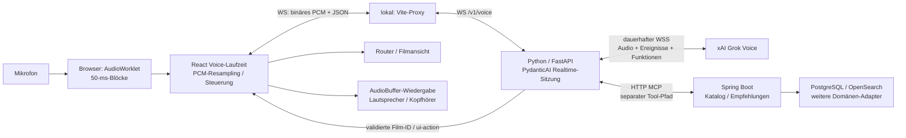

# Review: Zuverlässigkeit des Movie-Concierge-Sprachdialogs

Stand: 9. September 2026. Untersucht wurde der aktuelle Arbeitsbaum auf `feature/agent-roadmap`, einschließlich der noch nicht vollständig committeten Voice-Änderungen. Das Review selbst veränderte keine Implementierung. **Nachtrag:** Auf anschließenden Nutzerauftrag wurde PydanticAI im Projekt auf 2.42.0 aktualisiert; die folgenden ursprünglichen Befunde beschreiben weiterhin den untersuchten Stand 2.31.0 und werden durch den separaten 2.42-Vergleich ergänzt.

**Urteil:** Die Architektur ist grundsätzlich geeignet. Native Speech-to-Speech, Python als Sitzungs- und Tool-Orchestrator und Java als Eigentümer der Filmdomäne passen zusammen. Nachweisbare Fehler liegen in der Sitzungssteuerung, Fehlerbehandlung und Browserimplementierung. Ein Frameworkwechsel würde diese Fehler nicht automatisch beseitigen.

**Evidenzklassen:** **Bestätigt** bedeutet im Code eindeutig belegt oder deterministisch reproduziert. **Verdacht** bezeichnet einen plausiblen Zusammenhang mit den beobachteten Aussetzern. **Messung offen** bedeutet, dass die konkrete Ursache auf dem MacBook oder beim Provider noch nicht zugeordnet ist. Eine reproduzierte Schwachstelle ist nicht automatisch die Ursache jedes gehörten Aussetzers.

## 1. Tatsächlicher Architektur- und Ereignisfluss

Der UI-Pfeil aus Python läuft physisch über denselben Browser-WebSocket. Der Tool-Pfad ist ein eigener HTTP/MCP-Kanal; das Modell bekommt Funktionsdefinitionen und Ergebnisse über seine bestehende xAI-Verbindung. Es gibt keine zweite Steuerverbindung zum selben Provider-Gespräch.

Der lokale Audioweg ist Browser → Vite → Python → xAI. Spring Boot verarbeitet **kein Mikrofon- oder Antwortaudio**. Vite aktiviert WebSocket-Weiterleitung explizit: [vite.config.ts:13](/Users/niklastiede/IdeaProjects/imdb-clone/frontend/vite.config.ts:13). Python erzeugt eine Realtime-Sitzung und ein MCP-Toolset pro Browser-Sitzung, nicht pro Nutzerturn: [RealtimeVoiceRunner.run:70](/Users/niklastiede/IdeaProjects/imdb-clone/agent/src/imdb_agent/adapters/realtime_voice.py:70), [relay_voice:88](/Users/niklastiede/IdeaProjects/imdb-clone/agent/src/imdb_agent/adapters/realtime_voice.py:88).

PydanticAI übernimmt Provider-Verbindung, Ereignisübersetzung, Gesprächshistorie, Funktionsaufrufe, Tool-Ergebnisse und Modellfortsetzung. `audio_retention="transcript_only"` hält Audio nicht als vollständige Gesprächsaufzeichnung zurück; die Audiodeltas werden während der Sitzung weitergeleitet. Das zusätzliche Eingangstranskript stammt aus derselben Provider-Sitzung. Wir haben keine selbst gebaute serielle STT→Text-LLM→TTS-Pipeline.

### Installierter Stand

| Komponente | Version / Verwendung |
|---|---|
| PydanticAI / pydantic-ai-slim | 2.31.0; `Agent.realtime(...).session(...)` |
| Pydantic | 2.13.4 |
| xai-sdk | 1.19.0 installiert; nicht der verwendete Voice-Transport |
| Python MCP SDK | 1.29.0 |
| websockets / httpx | 16.1 / 0.28.1 |
| FastAPI / Starlette / Uvicorn | 0.139.1 / 1.3.1 / 0.51.0 |
| React / Vite / Material UI | 19.2.6 / 8.2.2 / 9.0.1 |
| Spring Boot / Spring AI / Java MCP SDK | 4.1.0 / 2.0.0 / 2.0.0 |

Python-Versionen wurden beim Review aus der damaligen aktiven `.venv` gelesen. SDK-Codebelege sind auf den Tag 2.31.0 fixiert, damit sie nach dem Update nachvollziehbar bleiben. Java-Versionen: [gradle.properties:1](/Users/niklastiede/IdeaProjects/imdb-clone/gradle.properties:1), [gradle.lockfile:84](/Users/niklastiede/IdeaProjects/imdb-clone/gradle.lockfile:84).

Der konkrete Adapter ist `XaiRealtimeModel` mit `XaiRealtimeConnection`. Letztere verwendet Teile von PydanticAIs OpenAI-WebSocket-Codec, ergänzt aber xAI-spezifische Konfiguration, Transkript- und Verbindungsereignisse. Das ist **keine vollständige Protokollkompatibilität**: [installiertes xai.py:239](https://github.com/pydantic/pydantic-ai/blob/v2.31.0/pydantic_ai_slim/pydantic_ai/realtime/xai.py#L239), [Session-Konfiguration:403](https://github.com/pydantic/pydantic-ai/blob/v2.31.0/pydantic_ai_slim/pydantic_ai/realtime/xai.py#L403).

### Effektive Einstellungen und Provider-Abgleich

Unser Code setzt `grok-voice-think-fast-2.0`, Stimme `eve`, `max_tokens=512`, `parallel_tool_calls=False` und Server-VAD mit 650 ms Stille. Der SDK-Serializer ergänzt `create_response=true` und `interrupt_response=true`; Threshold und Prefix werden nicht gesetzt. `input_transcription_model=auto` wird zu `grok-transcribe`. Reasoning ist nicht explizit konfiguriert. Belege: [Runner:58](/Users/niklastiede/IdeaProjects/imdb-clone/agent/src/imdb_agent/adapters/realtime_voice.py:58), [VAD-Serializer:976](https://github.com/pydantic/pydantic-ai/blob/v2.31.0/pydantic_ai_slim/pydantic_ai/realtime/_openai_protocol.py#L976), [xAI-Konfiguration:416](https://github.com/pydantic/pydantic-ai/blob/v2.31.0/pydantic_ai_slim/pydantic_ai/realtime/xai.py#L416).

Die aktuelle xAI-Dokumentation nennt für nicht gesetzte Werte Threshold **0,85**, Prefix **333 ms** und Reasoning **high**. Sie dokumentiert auch binären Audiotransport und opt-in Session-Resumption. Diese Provider-Defaults sind keine von uns gemessenen Handshake-Werte; die bestätigte `session.updated`-Konfiguration fehlt in unserer Diagnose. [Offizielle Speech-to-Speech-Dokumentation](https://docs.x.ai/developers/model-capabilities/audio/speech-to-speech)

Server-VAD erzeugt Antworten und Unterbrechungen automatisch. Unser Relay sendet bei erkanntem Sprachbeginn zusätzlich einen Cancel, falls sein lokaler Antwortstatus aktiv ist. Der SDK-Codec unterdrückt gewisse doppelte Cancels, aber beide Zustandsautomaten sollten mit tatsächlichen Ereignisfolgen geprüft werden. Kein Beleg für regelmäßig doppelte `response.create` pro normalem Sprachturn. [xAI-Ereignisreferenz](https://docs.x.ai/developers/rest-api-reference/inference/voice), [Cancel-Guard:507](https://github.com/pydantic/pydantic-ai/blob/v2.31.0/pydantic_ai_slim/pydantic_ai/realtime/openai.py#L507).

### Ergänzung: PydanticAI 2.42.0 als Update-Kandidat

Dein Hinweis wurde zusätzlich geprüft: **2.42.0 ist veröffentlicht und ein sinnvoller erster Update-Schritt.** Gemeint ist PydanticAI, nicht das separate Paket Pydantic. Zum Zeitpunkt des Reviews blieben Projekt und Service auf 2.31.0; 2.42 wurde zunächst in einer isolierten Projektkopie geprüft. Anschließend wurde das Update auf Nutzerauftrag im Projekt übernommen. [PydanticAI-Releases](https://github.com/pydantic/pydantic-ai/releases)

**Zusätzlicher relevanter SDK-Befund, hohe Priorität:** In 2.40 wurde ein Cancel-Rennen korrigiert: Ein zusätzlicher Client-Cancel während der bereits vom Provider veranlassten Sprachunterbrechung konnte die nächste Antwort treffen. Der Fix gilt auch für das von uns verwendete nackte `session.interrupt()`, nicht nur für `played_ms`. Damit gibt es einen konkreten Update-Grund gerade für unseren zusätzlichen Cancel im SpeechStart-Handler. Die Häufigkeit dieses Rennens in unseren gehörten Aussetzern ist noch nicht gemessen. [Upstream-Fix #8132](https://github.com/pydantic/pydantic-ai/pull/8132)

2.40 führte außerdem `handle_barge_in=True`, `interrupt(played_bytes=...)` und `played_audio_bytes` ein. Die automatische Variante ist standardmäßig **aus** und setzt genau einen `stream_audio()`-Consumer voraus, dessen Fortschritt die tatsächliche Wiedergabe abbildet. Unser Relay nutzt den allgemeinen Eventiterator und spielt im entfernten Browser ab. Deshalb würde bloßes Einschalten des Flags hier nicht die Browserpuffer oder den gehörten Offset korrekt steuern. Socket-Versand ist keine Bestätigung abgespielten Audios. [Release 2.40.0](https://github.com/pydantic/pydantic-ai/releases/tag/v2.40.0), [Barge-in-Implementierung #7870](https://github.com/pydantic/pydantic-ai/pull/7870)

**Vergleich mit 2.42.0, ohne Anwendungsänderungen:**

| Prüfung | Ergebnis |
|---|---|
| Gesamte Python-Testsuite | **139 bestanden** |
| Strikte Typprüfung mit Pyright | **0 Fehler, 0 Warnungen** |
| Recoverable Tool-Fehler aus F1 | beendet weiterhin die Sitzung |
| Verspätetes Tool nach Interrupt aus F2 | alte Sprache wird weiterhin als Turn 2 weitergeleitet |
| Eingangsqueue / Logfilter aus F4/F9 | unverändert reproduzierbar |
| xAI-Output-Truncation im SDK-Profil | weiterhin deaktiviert; Dokumentationsdrift besteht |

Diese Reproduktionen verwenden das reale jeweilige PydanticAI-Harness mit einer simulierten Provider-Verbindung. Sie belegen unsere verbleibenden Fehlerpfade, nicht das Auftreten jeder möglichen xAI-Wire-Reihenfolge. Ein frischer Live-Audiolauf mit 2.42 wurde nicht durchgeführt.

**Konsequenz für die Korrektur:** Zuerst den exakt gepinnten SDK-Stand samt Lockfile auf 2.42 aktualisieren und den korrigierten Cancel-Ablauf prüfen. Danach die verbleibenden Befunde behandeln. Ein eigener Workaround für den bereits upstream korrigierten Cancel sollte nicht auf Basis von 2.31 entwickelt werden. Tool-Fencing und Browser-Playback-Rückmeldung bleiben dagegen eigenständige Aufgaben.

## 2. Wichtigste Befunde, nach Wirkung und Evidenz

### F1 — Ein erwartbarer Tool-Fehler beendet das ganze Gespräch

**Priorität P1 · Bestätigt und reproduziert.**

**Code:** [Toolset mit `tool_error_behavior="failed"`:81](/Users/niklastiede/IdeaProjects/imdb-clone/agent/src/imdb_agent/adapters/realtime_voice.py:81), [Verarbeitung des Tool-Ergebnisses:160](/Users/niklastiede/IdeaProjects/imdb-clone/agent/src/imdb_agent/adapters/realtime_voice.py:160), [parse_grounded_movies:74](/Users/niklastiede/IdeaProjects/imdb-clone/agent/src/imdb_agent/adapters/catalog_contract.py:74).

**Mechanismus:** PydanticAI kann einen Tool-Fehler als `ToolReturnPart` mit fehlgeschlagenem Outcome zurückgeben. Unser Relay prüft nur den Typ, nicht das Outcome, und erwartet anschließend zwingend ein erfolgreiches Katalogobjekt. Eine Fehlernachricht löst `UnexpectedModelBehavior` aus; bei ungültigen Objekten kann die Schema-Validierung scheitern. Die übergeordnete Sitzungssteuerung beendet dann alle Tasks und schließt die Verbindung.

**Reproduktion:** Ein asynchrones `search_movies`, das `ToolFailed` wirft, führt mit dem installierten echten PydanticAI-Harness zu `UnexpectedModelBehavior: MCP tool returned non-object content`. Der Fehler wurde zuvor bereits als Tool-Ergebnis an die simulierte Provider-Verbindung gesendet. Das Modell hätte grundsätzlich noch darauf reagieren können.

**Symptom:** Filmsuche scheitert kurzzeitig; statt einer verständlichen Rückfrage oder Fehlermeldung bricht das ganze Sprachgespräch ab.

**Kleinste Korrektur:** Tool-Outcome vor dem Erfolgsparser behandeln. Fachlich erwartbare Tool-Fehler dürfen keine Filmkarten liefern, sollen aber die Sitzung erhalten. Fehlerhafte Provider-/Katalogverträge gesondert und mit sicherem Fehlercode melden. Nicht pauschal sämtliche Exceptions verschlucken.

**Verifikation:** Erfolg, kontrollierter Tool-Fehler, Timeout und ungültiger Katalogvertrag separat testen; nach einem recoverable Fehler muss ein weiterer Nutzerturn funktionieren. Genau einmalige Ergebnisrückgabe an den Provider prüfen.

### F2 — Eine alte Tool-Ausführung kann nach Unterbrechung neue, veraltete Sprache erzeugen

**Priorität P1 · Kontrollfluss bestätigt; mit echtem Harness und simuliertem Provider reproduziert.**

**Code:** [relay_voice, Interrupt und Turnwechsel:119](/Users/niklastiede/IdeaProjects/imdb-clone/agent/src/imdb_agent/adapters/realtime_voice.py:119), [später Filter für Tool-Ergebnisse:163](/Users/niklastiede/IdeaProjects/imdb-clone/agent/src/imdb_agent/adapters/realtime_voice.py:163), [VoiceGrounding.begin:69](/Users/niklastiede/IdeaProjects/imdb-clone/agent/src/imdb_agent/concierge/voice.py:69). SDK: [interrupt:1192](https://github.com/pydantic/pydantic-ai/blob/v2.31.0/pydantic_ai_slim/pydantic_ai/realtime/_session.py#L1192), [ToolResult-Versand:2175](https://github.com/pydantic/pydantic-ai/blob/v2.31.0/pydantic_ai_slim/pydantic_ai/realtime/_session.py#L2175), [nachgelagertes öffentliches Result-Event:2340](https://github.com/pydantic/pydantic-ai/blob/v2.31.0/pydantic_ai_slim/pydantic_ai/realtime/_session.py#L2340), [Modellfortsetzung:461](https://github.com/pydantic/pydantic-ai/blob/v2.31.0/pydantic_ai_slim/pydantic_ai/realtime/openai.py#L461).

**Mechanismus:** `session.interrupt()` cancelt die Modellantwort, nicht automatisch laufende Tools. PydanticAI schickt deren Ergebnis an den Provider und fordert eine Fortsetzung an, **bevor** unser Relay das öffentliche Tool-Ergebnis sieht. Unser später Turnfilter verhindert alte Karten und Navigation, greift für diesen Provider-Versand aber zu spät. Beim nächsten Sprachbeginn setzt `grounding.begin()` außerdem `cancelled=False`. Nun eintreffende Sprachantworten werden dem aktuellen Turn zugeschrieben.

**Reproduktion:** Langsame Suche in Turn 1 → Nutzer unterbricht → Turn 2 „Never mind, just say hello“ → altes Tool wird freigegeben. Beobachteter Versand: `BinaryAudio → CancelResponse → ToolResult`. Alte Karten: **0**. Alte Sprachantwort: **weitergeleitet**, Transkript mit **Turn 2** versehen.

Der SDK besitzt bereits einen Filter für verspätete Frames einer gecancelten `response_id`: [openai.py:609](https://github.com/pydantic/pydantic-ai/blob/v2.31.0/pydantic_ai_slim/pydantic_ai/realtime/openai.py#L609). Das hilft gegen alte Frames derselben Antwort, nicht gegen eine **neu erzeugte** Antwort aufgrund eines alten Tools. Die konkrete xAI-Reaktion auf jede mögliche Race-Reihenfolge braucht zusätzlich einen Wire-Replay oder begrenzten Live-Test.

**Symptom:** Nach „stop“ oder einem geänderten Wunsch spricht der Agent wieder über den alten Film, unterbricht die neue Antwort oder antwortet scheinbar ohne Bezug.

**Kleinste Korrektur:** Eine Sitzungssteuerung muss Tool-Aufrufe an einen Turn beziehungsweise eine Intent-Generation binden und veraltete Ergebnisse **vor** Provider-Fortsetzung sperren. Für die heutigen lesenden Tools Ausführung abbrechen, soweit möglich; verspätete Ergebnisse trotzdem abweisen. Eine notwendige Protokollauflösung des offenen Function Calls darf keine alte Sprachantwort starten. Hier reicht ein zusätzlicher Filter im heutigen `FunctionToolResultEvent`-Handler nicht. Dafür eine gezielte Adapter-/Harness-Erweiterung prüfen, kein blindes Monkey-Patching privater SDK-Felder.

**Verifikation:** Langsames Tool mit Interrupt vor/nach Tool-Ende, neuer Nutzerwunsch vor/nach finalem Transkript, mehrere Unterbrechungen. Invariante: kein altes Ergebnis erzeugt neue Sprache oder Navigation im neuen Turn. Sprachabbruch und Abbruch einer späteren schreibenden Aktion müssen getrennte Zustände bleiben.

### F3 — Die Audioanzeige erzeugt kontinuierlich neue CSS-Regeln

**Priorität P2 · Wachstum im echten Browser bestätigt; Zusammenhang mit hörbaren Aussetzern noch zu messen.**

**Code:** [RAF mit `setLevels`:188](/Users/niklastiede/IdeaProjects/imdb-clone/frontend/src/features/concierge/hooks/useConciergeVoice.ts:188), [VoiceSignal / dynamische `sx`-Höhe:53](/Users/niklastiede/IdeaProjects/imdb-clone/frontend/src/features/concierge/components/ConciergeVoicePanel.tsx:53), [versteckter Drawer bleibt montiert:83](/Users/niklastiede/IdeaProjects/imdb-clone/frontend/src/features/concierge/components/ConciergeDrawer.tsx:83).

**Mechanismus:** Unrunde, wechselnde Audiopegel landen pro Animationsframe in MUI-`sx`. Emotion erzeugt fortlaufend neue Styles. Gleichzeitig rendert der ganze Concierge-Eigentümer einschließlich verborgener Inhalte neu. Nach Minimierung existieren Dock und verstecktes Panel parallel. Auf diesem Main Thread laufen auch PCM-Konvertierung, Socket-Callbacks und das Planen neuer AudioBuffer.

**Reproduktion:** Aktuelle Anwendung in Chromium, simulierte WebSocket-Sitzung und deterministisch wechselnde Analyser-Werte, keine Provider-Aufrufe: **632 → 8.416 CSS-Regeln nach 5 Sekunden → 17.962 nach weiteren 5 Sekunden**. Es blieb bei genau **einem AudioContext**. Damit ist zugleich ein vermeintlicher Sitzungsneustart durch diese Rerenders nicht bestätigt.

**Symptom:** Zunehmende CPU-/DOM-/Speicherlast; plausible Audiolücken bei verzögerter Main-Thread-Verarbeitung.

**Kleinste Korrektur:** Stabile CSS-Klassen, Pegel per Inline-Style/CSS-Variable oder Transform setzen; Mess-/Renderzustand auf die Audioanzeige begrenzen; unsichtbare Anzeige nicht weiter aktualisieren.

**Verifikation:** Gleicher Replay über 180 Sekunden, konstante CSS-Regelzahl, Renderzählung, Long Tasks und Audio-Unterläufe vor/nach Änderung. Erst die Zeitkorrelation belegt den Anteil am Stottern.

### F4 — Ein kurzer Empfangsrückstau wird als ungültige Nachricht zum Sitzungsabbruch

**Priorität P2 · Fehlerpfad reproduziert; Auftreten im normalen Betrieb offen.**

**Code:** [BrowserVoiceTransport:32](/Users/niklastiede/IdeaProjects/imdb-clone/agent/src/imdb_agent/web/voice.py:32), [put_nowait / QueueFull:44](/Users/niklastiede/IdeaProjects/imdb-clone/agent/src/imdb_agent/web/voice.py:44), [Fehlerklassifikation:128](/Users/niklastiede/IdeaProjects/imdb-clone/agent/src/imdb_agent/web/voice.py:128).

**Mechanismus:** Die Eingangsqueue fasst acht Nachrichten. Bei üblichen 50-ms-Audioframes sind das etwa 400 ms. Kann der Consumer wegen eines langsamen Provider-Sends oder eines Bursts nicht folgen, beendet schon das neunte gültige Frame die Sitzung mit `voice_input_backpressure`; außen wird daraus „Invalid voice message“. Steuerbefehle außer `end` teilen sich diese Queue. `end` wird bereits beim Lesen gesondert behandelt.

**Reproduktion:** Neun gültige PCM-Frames ohne zwischenzeitlichen Consumer-Fortschritt lösen genau diesen Fehler aus. Das beweist die Reaktion auf Rückstau, nicht, dass jede lokale Verzögerung von 400 ms tatsächlich diese Queue füllt.

**Symptom:** Sporadischer Disconnect bei Netz-/Scheduler-Spitzen, irreführende Fehlermeldung; Interrupt/Mute können hinter Audio warten.

**Kleinste Korrektur:** Explizite, zeitbasierte und begrenzte Rückstau-Policy statt sofortigem Protokollfehler. Audio-Latenzbudget definieren, Steuerbefehle priorisieren und echte Überlast kontrolliert melden. Nicht unbemerkt Sprachsamples verwerfen und nicht einfach unbegrenzt puffern.

**Verifikation:** 100/400/800-ms-Provider-Send-Verzögerungen und Audio-Bursts injizieren. Speicher und Latenz bleiben begrenzt; `interrupt`/`end` bleiben zeitnah; keine Fehlklassifikation als ungültige Nutzernachricht.

### F5 — Jitter und AudioContext-Ausfälle sind unzureichend erfasst

**Priorität P2 · Implementierungslücken bestätigt; tatsächliche Hardware-/Netzursache offen.**

**Code:** [BrowserAudio.start:32](/Users/niklastiede/IdeaProjects/imdb-clone/frontend/src/features/concierge/audio/browserAudio.ts:32), [play:72](/Users/niklastiede/IdeaProjects/imdb-clone/frontend/src/features/concierge/audio/browserAudio.ts:72), [Scheduling:98](/Users/niklastiede/IdeaProjects/imdb-clone/frontend/src/features/concierge/audio/browserAudio.ts:98).

**Mechanismus:** Die Wiedergabe plant auf dem Main Thread einzelne AudioBuffer. Solange noch Audio vorausgeplant ist, schließen Chunks lückenlos an. Nach einem Unterlauf wird neu mit 300 ms Vorlauf gestartet. Eine verspätete Nachlieferung erzeugt daher eine Lücke zuzüglich dieses erneuten Vorlaufs. 300 ms sind ein Parameter, keine allgemeine Garantie. Es gibt keinen Wiedergabe-Worklet mit Ringpuffer.

`AudioContext.resume()` erfolgt nur beim Start. Zustandsänderungen, Worklet-`processorerror` und Wiederaufnahme nach Betriebssystem-/Geräteunterbrechung sind nicht angeschlossen. Bei suspendierter Audio-Uhr kann der Socket weiter Audio liefern, bis die 60-Sekunden-Grenze erreicht ist. Ein Tabwechsel allein beweist keine Suspendierung.

**Vorhandene Laufzeitevidenz:** Ein bereits vor diesem Review erzeugter synthetischer Navigationslauf enthält trotz 300-ms-Vorlauf eine **geplante Audiolücke von 647 ms**: [Messdatei](/tmp/imdb-voice-navigation-after.log). Das ist eine Scheduling-Messung, keine akustische Messung des MacBook-Ausgangs und kein Nachweis der Ursache. Andere vorhandene Läufe hatten keine Lücke.

**Kleinste Korrektur:** Queue-Tiefe, Unterläufe, Context-Zustand und Long Tasks instrumentieren. Context-/Worklet-Fehler sichtbar und gezielt wiederaufnehmbar machen. Zuerst F3 entfernen; anhand gemessener Jitter-Verteilung entscheiden, ob ein adaptiver Puffer oder ein Wiedergabe-Worklet nötig ist.

**Verifikation:** Deterministische Chunk-Jitter-Muster und lange Main-Thread-Tasks; `context.suspend()` mitten in einer Antwort; reales Chrome/Safari, Tabwechsel, Sleep/Wake und Gerätewechsel. Keine pauschale weitere Puffervergrößerung ohne Latenzvergleich.

### F6 — Abgespielter Audioanteil und Provider-Gesprächskontext können auseinanderlaufen

**Priorität P2 · Fehlender Abgleich und Dokumentationsdrift bestätigt.**

**Code:** [BrowserAudio.interrupt:128](/Users/niklastiede/IdeaProjects/imdb-clone/frontend/src/features/concierge/audio/browserAudio.ts:128), [Relay-Cancel:140](/Users/niklastiede/IdeaProjects/imdb-clone/agent/src/imdb_agent/adapters/realtime_voice.py:140), [SDK-Profil:42](https://github.com/pydantic/pydantic-ai/blob/v2.31.0/pydantic_ai_slim/pydantic_ai/realtime/profiles.py#L42), [SDK-Prüfung von played_ms:1205](https://github.com/pydantic/pydantic-ai/blob/v2.31.0/pydantic_ai_slim/pydantic_ai/realtime/_session.py#L1205).

**Mechanismus:** Der Browser leert die Wiedergabe, meldet aber keinen gehörten Offset. Python cancelt nur Generierung. PydanticAI 2.31 deaktiviert Output-Truncation für xAI; unser Codekommentar übernimmt diese Annahme. Die aktuelle xAI-Ereignisreferenz dokumentiert dagegen `conversation.item.truncate` einschließlich Kürzung von Audio und Transkript sowie einer Bestätigung. [Offizielle Ereignisreferenz](https://docs.x.ai/developers/rest-api-reference/inference/voice)

**Symptom:** Nach einer Unterbrechung kann das Modell Wissen als bereits ausgesprochen behandeln, das der Nutzer nicht gehört hat. Bei bloßem Generierungsende kann der Browser weiterhin viele Sekunden Audio abspielen.

**Kleinste Korrektur:** Provider-Fähigkeit mit gepinntem Modell und einem gezielten Kompatibilitätstest bestätigen, SDK-Unterstützung abgleichen und erst dann integrieren. Browser meldet `response/item ID` und abgespielte Dauer; Cancel und Truncate werden bewusst koordiniert. Nur das Profil-Flag umzuschalten ist keine ausreichende Korrektur.

**Verifikation:** Bekannte längere Antwort nach definierter Abspieldauer unterbrechen; Provider-Bestätigung, geleerte lokale Queue, keine verspätete Wiedergabe und plausibler Folgekontext prüfen. Die API-Dokumentation ersetzt diesen Laufzeittest nicht.

### F7 — „Inaktivität“ wird während aktiver Antworten gemessen

**Priorität P2 · Im Code bestätigt.**

**Code:** [SpeechStart als Activity-Signal:138](/Users/niklastiede/IdeaProjects/imdb-clone/agent/src/imdb_agent/adapters/realtime_voice.py:138), [idle:251](/Users/niklastiede/IdeaProjects/imdb-clone/agent/src/imdb_agent/adapters/realtime_voice.py:251), [Sitzungslimits:86](/Users/niklastiede/IdeaProjects/imdb-clone/agent/src/imdb_agent/settings.py:86), [Gesamttimer:109](/Users/niklastiede/IdeaProjects/imdb-clone/agent/src/imdb_agent/web/voice.py:109).

**Mechanismus:** Der 45-Sekunden-Timer wird nur durch neuen Sprachbeginn zurückgesetzt. Laufende Nutzersprache, Tools, Modellantwort, Browserwiedergabe oder Mute verhindern den Ablauf nicht. Er kann also „No speech detected“ melden und eine aktive Sitzung schließen. Daneben bestehen bewusste Pilotlimits: standardmäßig 180 Sekunden Gesamtdauer, 20 Sitzungsstarts pro Prozess, zwei aktive Sitzungen und kumulative Usage-Limits. Der Startzähler wird bei Sitzungsende nicht zurückgesetzt; das ist ein Prozessbudget, keine Begrenzung nur gleichzeitig aktiver Gespräche.

**Symptom:** Reproduzierbare Abbrüche um 45 beziehungsweise 180 Sekunden oder dauerhaft „unavailable“ nach Ausschöpfen des Prozessbudgets. Das erklärt keine beliebig frühe Lücke ohne entsprechende Zeitkorrelation.

**Kleinste Korrektur:** Inaktivität nur im definierten wartenden Zustand messen; Sprechen, Tool-Ausführung, Antwort und tatsächliche Wiedergabe berücksichtigen. Pilot-Gesamtdauer und Budget beibehalten, aber vor Ablauf transparent ankündigen und eindeutig klassifizieren.

**Verifikation:** Virtuelle Uhr für langes Sprechen, langsames Tool, lange Antwort, Mute und echtes Schweigen; getrennte Assertions für Idle, Gesamtdauer und Budgetende.

### F8 — Navigation wird ausgelöst, aber nicht bestätigt

**Priorität P2 · Bestätigte Zuverlässigkeitslücke; keine direkte Audio-Ursache.**

**Code:** [VoiceGrounding.action:80](/Users/niklastiede/IdeaProjects/imdb-clone/agent/src/imdb_agent/concierge/voice.py:80), [Frontend-Grounding und Deduplizierung:169](/Users/niklastiede/IdeaProjects/imdb-clone/frontend/src/features/concierge/hooks/useConciergeVoice.ts:169), [onAction / void navigate:39](/Users/niklastiede/IdeaProjects/imdb-clone/frontend/src/features/concierge/components/ConciergeExperience.tsx:39), [Film-Ladefehler:107](/Users/niklastiede/IdeaProjects/imdb-clone/frontend/src/features/catalog/pages/MovieDetailPage.tsx:107), [Browserbefehle:18](/Users/niklastiede/IdeaProjects/imdb-clone/agent/src/imdb_agent/concierge/voice.py:18).

**Gut:** Stabile Java-Film-IDs, typisierte Aktionen, finale Nutzertranskripte, Grounding und Turnfilter. Mehrdeutigkeit wird nicht über beliebige Modell-URLs aufgelöst. Der schnelle Navigationspfad verlangt einen vollständigen direkten Befehl und genau einen passenden Film. Eine Aktion pro Turn wird lokal dedupliziert.

**Lücke:** Es gibt keine `action_id`, Empfangsbestätigung oder Rückmeldung über erfolgreich geladene Filmdaten. URL-Wechsel kann in „Movie unavailable“ enden. Der Agent weiß das nicht. Die Policy verbietet zwar die Behauptung, eine Seite sei bereits geöffnet; dadurch entsteht noch keine verlässliche Ausführungsbestätigung.

**Kleinste Korrektur:** Kleines Aktionsregister mit Sitzungs-/Turn-/Action-ID und Zuständen angenommen, ausgeführt, fehlgeschlagen, überholt. UI meldet Route **und Datenbereitschaft**, mit Deadline. Erst diese Rückmeldung erlaubt eine Erfolgsbestätigung. Bereits ausgeführte Navigation wird durch Sprachabbruch nicht automatisch rückgängig gemacht.

**Verifikation:** Erfolg, 404, verzögertes Laden, doppeltes Event, Verbindungsabbruch zwischen Versand und ACK sowie neuer Wunsch vor Ausführung. Bei Reconnect kein blindes Wiederholen alter Aktionen.

### F9 — Die derzeitige Telemetrie kann die Fehler nicht auseinanderhalten

**Priorität P2 · Bestätigt und teilweise reproduziert.**

**Code:** [nur HTTP-Middleware:138](/Users/niklastiede/IdeaProjects/imdb-clone/agent/src/imdb_agent/adapters/http_observability.py:138), [Voice instrument=False:84](/Users/niklastiede/IdeaProjects/imdb-clone/agent/src/imdb_agent/adapters/realtime_voice.py:84), [Fehler-Log:132](/Users/niklastiede/IdeaProjects/imdb-clone/agent/src/imdb_agent/web/voice.py:132), [Logging-Allowlist:11](/Users/niklastiede/IdeaProjects/imdb-clone/agent/src/imdb_agent/adapters/logging.py:11).

**Mechanismus:** HTTP-Instrumentierung erfasst keine WebSocket-Sitzung. Voice hat keine durchgängige Korrelation für Sitzung, Antwort, Tool und UI-Aktion. Die beim unerwarteten Fehler geloggten Felder `error_type` und `stages` werden von unserer eigenen Logging-Allowlist entfernt. Direkter Aufruf des Filters bestätigt: übrig bleibt nur `event=voice_session_failed`. Zudem werden verschiedene Timeouts als Sitzungsablauf und verschiedene `ValueError` als ungültige Nachricht zusammengefasst.

**Kleinste Korrektur:** Inhaltsfreier Voice-Beobachter mit kontrollierten Fehlercodes, Close-Code/Initiator, Phasen und IDs. Sichere Felder explizit zulassen; keine rohen Exception-Messages, Transkripte, Audio- oder Headerdaten loggen. IDs in Traces/Logs, nicht als hochkardinale Metriklabels verwenden.

**Verifikation:** Für Tool-Fehler, Eingangsüberlast, Browser-Ende, Provider-Disconnect, Send-Timeout und echtes Sitzungslimit jeweils unterscheidbare Ereignisse; Tests verhindern sensible Payloads in Logs. Der genaue Messplan folgt unten.

## 3. Weitere Prüfungsergebnisse und ausgeschlossene Standardverdächte

### Frontend-Lebensdauer

Der Concierge ist oberhalb der Routenseiten montiert: [AppProviders:22](/Users/niklastiede/IdeaProjects/imdb-clone/frontend/src/app/AppProviders.tsx:22). Socket und Audio liegen in Hook-Refs; normale Rerenders, Karten und Filmnavigation erzeugen keine neue Sitzung. Ein Accountwechsel tauscht den Eigentümer bewusst aus und bereinigt die alte Sitzung: [ConciergeExperience:22](/Users/niklastiede/IdeaProjects/imdb-clone/frontend/src/features/concierge/components/ConciergeExperience.tsx:22). Die geprüften Tests decken Navigationserhalt, verspätete Callbacks nach Ende und explizite Unterbrechungen ab.

Die letzte Verbesserung mit `reply-complete` und `replyPending || sources.size > 0` trennt Generierungsende von lokal ausstehender Wiedergabe für den Button bereits sinnvoll. Dieser Browserzustand wird aber noch nicht an Python/Provider zurückgemeldet. Ein Reconnect legt neue Ressourcen und neuen Kontext an; es besteht kein transparenter Gesprächsfortsatz.

### Audioformat, Speicher und Main Thread

[Capture-Worklet:1](/Users/niklastiede/IdeaProjects/imdb-clone/frontend/src/features/concierge/audio/capture.worklet.js:1) sammelt etwa 50 ms des ersten Eingangskanals als Float32 bei der tatsächlichen AudioContext-Rate. Diese wird an den Encoder übergeben; feste 48 kHz werden nicht angenommen. Die echte Hardware-Rate und wirksamen MediaTrack-Constraints auf deinem MacBook wurden in diesem Review nicht ausgelesen.

[PcmEncoder:4](/Users/niklastiede/IdeaProjects/imdb-clone/frontend/src/features/concierge/audio/pcm.ts:4) wandelt zustandsbehaftet auf **24 kHz, mono, PCM16 little-endian** um. Typisch sind 1.200 Samples beziehungsweise 2.400 Bytes je 50-ms-Netzframe, also 48 kB/s unkomprimiert. Die Umwandlung und temporäre Arrays entstehen auf dem Main Thread. Das gewichtete Mittel ist kein hochwertiger Antialias-Filter; die vorhandenen Tests prüfen vor allem Rate/Dauer/DC. Signalqualität mit Sinus-Sweeps zu testen ist sinnvoll, aber daraus folgt keine belegte Ursache für das Piepen.

Browser↔Python verwendet binäres PCM. Der installierte xAI-Codec verwendet auf Python↔Provider dagegen JSON mit Base64: [openai.py:441](https://github.com/pydantic/pydantic-ai/blob/v2.31.0/pydantic_ai_slim/pydantic_ai/realtime/openai.py#L441). Das ist zusätzlicher Encoding-/Parsing-Aufwand, aber kein bestätigter Engpass. xAI dokumentiert mittlerweile auch binäre Frames; eine Umstellung wäre eine gezielte Transportoptimierung nach Profiling. [Audio-Transport-Dokumentation](https://docs.x.ai/developers/model-capabilities/audio/speech-to-speech)

Audio wird nicht bis zum vollständigen Antwortende gesammelt. Browserausgabe bleibt auf 60 Sekunden vorausgeplante Wiedergabe begrenzt. Der Browser begrenzt außerdem ausstehende Socketbytes auf 240.000 Bytes, ungefähr fünf Sekunden PCM. Dahinter bestehen weitere, verschieden begrenzte Queues. Insbesondere ist PydanticAIs öffentliche Eventqueue unbeschränkt: [SDK _session.py:697](https://github.com/pydantic/pydantic-ai/blob/v2.31.0/pydantic_ai_slim/pydantic_ai/realtime/_session.py#L697). Ein langsamer Browser-Send blockiert den seriellen Relay-Ausgang, während der Provider-Pump weiter empfangen kann. Damit können Audio und danach folgende Steuerereignisse verzögert werden. **Verdacht**, noch keine gemessene Queue-Explosion. Bounded Output und priorisierte Steuerung müssen Ereignisreihenfolge und Audio-Zuordnung erhalten.

### Python und MCP: kein Beleg für die vermutete blockierende Suchschleife

PydanticAI startet Tools in eigenen Tasks: [Dispatch:2437](https://github.com/pydantic/pydantic-ai/blob/v2.31.0/pydantic_ai_slim/pydantic_ai/realtime/_session.py#L2437). Der Provider-Pump läuft unabhängig; der kurze Toolmanager-Lock umfasst nicht den gesamten asynchronen MCP-Aufruf. Audioempfang, Relay-Events und Idle-Überwachung laufen ebenfalls als Tasks. Deshalb ist „ein await auf die Filmsuche blockiert die einzige Audio-Empfangsschleife“ für diesen installierten Stand keine zutreffende Beschreibung.

Der SDK-Send-Lock serialisiert Provider-Frames, unter anderem Function-Output plus Fortsetzung: [send_frame:1225](https://github.com/pydantic/pydantic-ai/blob/v2.31.0/pydantic_ai_slim/pydantic_ai/realtime/_session.py#L1225). Langsamer Socket-Versand kann trotzdem andere Send-Aufgaben warten lassen. Event-Loop-Lag, Lock-Wartezeit und Queue-Alter sind hierfür die passenden Messwerte.

MCP-Initialisierung erfolgt pro Sprachsitzung mit 5 Sekunden Init-/12 Sekunden Read-Timeout. Tool-Discovery wird gecacht; Aufrufe verwenden einen asynchronen Client: [mcp.py:1162](https://github.com/pydantic/pydantic-ai/blob/v2.31.0/pydantic_ai_slim/pydantic_ai/mcp.py#L1162), [Toolcache:1277](https://github.com/pydantic/pydantic-ai/blob/v2.31.0/pydantic_ai_slim/pydantic_ai/mcp.py#L1277), [Aufruf:1393](https://github.com/pydantic/pydantic-ai/blob/v2.31.0/pydantic_ai_slim/pydantic_ai/mcp.py#L1393).

Java bietet stateless SYNC-WebMVC-MCP mit virtuellen Threads und 10-Sekunden-Request-Timeout an. Titelabfragen können nach der lexikalischen Suche sofort zurückkehren; beschreibende Suchen führen gegebenenfalls anschließend Embedding und semantische Suche aus: [OpenSearchMovieSearchService:238](/Users/niklastiede/IdeaProjects/imdb-clone/src/main/java/com/thecodinglab/imdbclone/catalog/internal/search/OpenSearchMovieSearchService.java:238). Nicht jede Suche nach „Forrest Gump“ braucht ein Embedding. Die tatsächlichen Tail-Latenzen und der Abbruch darunterliegender I/O nach Timeout bleiben zu messen.

Der SDK fordert nach einem Tool-Ergebnis eine neue Modellantwort an und wartet dabei auf **Generierungsende**, nicht auf den Browser-Wiedergabecursor: [openai.py:544](https://github.com/pydantic/pydantic-ai/blob/v2.31.0/pydantic_ai_slim/pydantic_ai/realtime/openai.py#L544). Der Browser reiht Audio seriell ein, verhindert dadurch grundsätzlich gleichzeitige Ausgabe seiner Chunks, kann aber einen langen Rückstau entwickeln. xAI weist ebenfalls auf die Abstimmung von Tool-Fortsetzung und Wiedergabe hin. [Offizielle Tool-/Playback-Hinweise](https://docs.x.ai/developers/model-capabilities/audio/speech-to-speech)

### Echo und das gemeldete Piepen

Mikrofon-Constraints verlangen Echo Cancellation, Noise Suppression und Automatic Gain Control: [BrowserAudio.start:33](/Users/niklastiede/IdeaProjects/imdb-clone/frontend/src/features/concierge/audio/browserAudio.ts:33). Ob Browser und Gerät das tatsächlich wirksam umsetzen, muss über `track.getSettings()` und einen Lautsprecher-/Kopfhörervergleich geprüft werden. Die Pegelvisualisierung ist kein zweiter VAD; Gesprächsgrenzen kommen vom Provider.

Der Capture-Worklet gibt selbst Stille aus; wir routen das Mikrofon nicht absichtlich auf die Lautsprecher. Es wurde kein Oszillator oder absichtlich erzeugter Hinweiston im Feature gefunden. Die Filmansicht startet den Trailer erst nach einem expliziten Klick: [MovieTrailer:23](/Users/niklastiede/IdeaProjects/imdb-clone/frontend/src/features/catalog/components/MovieTrailer.tsx:23), [Play-Interaktion:83](/Users/niklastiede/IdeaProjects/imdb-clone/frontend/src/features/catalog/components/MovieTrailer.tsx:83). Navigation allein startet daher keinen Filmton.

**Piepen bleibt ungeklärt.** Denkbar sind Provider-Audio, akustische Rückkopplung, Umgebungsgeräusch oder Geräte-/Browserverhalten. Ein früherer synthetischer PCM-Lauf zeigte bei einer einfachen Spektralprüfung keinen anhaltenden schmalbandigen Hochton; das widerlegt deine Beobachtung nicht. Nächster Test: dasselbe synthetische Gespräch mit Kopfhörern/Lautsprechern, stiller Seite/absichtlich laufendem Trailer; Zeitpunkte von VAD, Interrupt und Ton markieren. Erst damit lässt sich falscher Barge-in von einer reinen Wiedergabestörung trennen.

## 4. Kubernetes, Heartbeats, Reconnect und Benutzerzuordnung

**Aktuelle Voice ist lokal begrenzt.** Settings lehnen Voice außerhalb `local` ab: [settings.py:128](/Users/niklastiede/IdeaProjects/imdb-clone/agent/src/imdb_agent/settings.py:128). Das Produktionsmanifest setzt `production` und aktiviert Voice nicht: [agent.yaml:59](/Users/niklastiede/IdeaProjects/imdb-clone/infrastructure/clusters/home/apps/agent.yaml:59). Der Kubernetes-Agent ist daher kein belegter Ursprung der lokalen Audioaussetzer. Ein gegebenenfalls auf Produktion gerichteter MCP-Endpunkt könnte die Tool-Latenz beeinflussen; dessen Route muss pro Messlauf erfasst werden.

Read-only-Clusterprüfung: Agent-Pod Running, ein historischer Neustart am **29. August 2026, 23:35 UTC**, vorheriger Status `Unknown`/Exit 255; keine aktuellen Pod-Events. Momentaufnahme: CPU etwa 5m, Speicher 189 MiB bei Limits 500m/512Mi. Das ist **kein Nachweis**, dass nie CPU-Throttling oder Speicherdruck auftritt; dafür fehlen Zeitreihen zum Aussetzer.

Für spätere Produktions-Voice führt Traefik `/concierge-api/v1` direkt zum Python-Service und entfernt das Präfix: [ingress.yaml:19](/Users/niklastiede/IdeaProjects/imdb-clone/infrastructure/clusters/home/apps/ingress.yaml:19), [Middleware:64](/Users/niklastiede/IdeaProjects/imdb-clone/infrastructure/clusters/home/apps/traefik-middlewares.yaml:64). Kein zusätzlicher Java-/Frontend-Nginx-Hop. Ein spezieller WebSocket-Timeout ist in diesen Manifesten nicht gesetzt; daraus lässt sich weder eine garantierte Haltedauer noch ein Timeout als Ursache ableiten.

Auf Python→xAI verwendet das installierte `websockets.connect` mangels Override Ping-Intervall und Ping-Timeout von je 20 Sekunden: [Verbindungsaufbau:920](https://github.com/pydantic/pydantic-ai/blob/v2.31.0/pydantic_ai_slim/pydantic_ai/realtime/_openai_protocol.py#L920). Uvicorns installierte WebSocket-Defaults sind ebenfalls 20/20 Sekunden, abhängig vom gewählten WS-Backend. Es gibt keinen eigenen Ende-zu-Ende-Anwendungsheartbeat oder automatischen Browser-Reconnect. Uvicorns HTTP-Keepalive von fünf Sekunden ist kein bewiesener fünfsekündiger WebSocket-Cutoff.

Produktion nutzt **eine Replik, Recreate**, 45 Sekunden Termination Grace, fünf Sekunden `preStop` und Uvicorn mit 40 Sekunden Graceful Shutdown: [agent.yaml:21](/Users/niklastiede/IdeaProjects/imdb-clone/infrastructure/clusters/home/apps/agent.yaml:21), [Dockerfile:39](/Users/niklastiede/IdeaProjects/imdb-clone/agent/Dockerfile:39). Readiness berücksichtigt kein Voice-Draining: [health.py:30](/Users/niklastiede/IdeaProjects/imdb-clone/agent/src/imdb_agent/web/health.py:30). Vor Produktionsaktivierung sind daher kontrolliertes Session-Draining, Annahmestopp neuer Sitzungen und verständliche Reconnect-/Kontextverlustanzeige erforderlich. Einfach Rolling Updates einzuschalten löst die lokale Zustandsverteilung nicht.

Gesprächszustand, Grounding und Zähler leben pro Prozess/Verbindung. Ein offener WebSocket bleibt an seinem Pod; Sticky Sessions sind dafür nicht grundsätzlich erforderlich. Nach Podwechsel fehlt trotzdem die alte Python-Sitzung. xAI dokumentiert opt-in Resumption über eine Conversation-ID mit begrenzter Aufbewahrung; unser Runner aktiviert dies nicht. Resumption ist kein Beleg für eine zweite parallele Steuerverbindung. [Offizielle Resumption-Dokumentation](https://docs.x.ai/developers/model-capabilities/audio/speech-to-speech)

Für Wiederaufnahme braucht es außerdem eine klare Action-Deduplizierung, einen neuen Connection-Epoch und das Verwerfen alter Audiopuffer. Provider-Kontext wiederherzustellen allein genügt nicht.

Java authentifiziert MCP als festen Workload `movie-concierge-agent`, mit separater stateless Security Chain: [McpBearerAuthenticationFilter:58](/Users/niklastiede/IdeaProjects/imdb-clone/src/main/java/com/thecodinglab/imdbclone/assistant/internal/security/McpBearerAuthenticationFilter.java:58), [McpSecurityConfig:30](/Users/niklastiede/IdeaProjects/imdb-clone/src/main/java/com/thecodinglab/imdbclone/assistant/internal/security/McpSecurityConfig.java:30). Für die heutigen lesenden Katalogtools passt das. Originprüfung und Account-Key im React-Baum sind aber keine delegierte Benutzeridentität. Persönliche Watchlist-Schreibaktionen benötigen künftig Java-validierte Benutzerberechtigung und Idempotenz; sie sind heute explizit nicht Teil der Voice-Tools.

## 5. Die drei wahrscheinlichsten Ursachenklassen unserer Aussetzer

1. **Browserseitige Versorgungslücken der Wiedergabe.** Das reproduzierte CSS-Wachstum belastet den Main Thread; dort wird auch Audio geplant. Im vorhandenen synthetischen Lauf existiert tatsächlich eine Scheduling-Lücke. Die Verursachung durch Rendering gegenüber Provider-/Netzjitter muss noch korreliert werden. Dies ist der stärkste Kandidat für Stottern bei weiterhin offener Sitzung und ohne Tool.
2. **Inkonsistente Unterbrechungssteuerung im SDK und rund um Tools.** Der verwendete SDK-Stand 2.31 enthält zusätzlich das in 2.40 korrigierte Cancel-Rennen gegen die nächste Antwort. Der reproduzierte verspätete Tool-Output kann wieder Sprache zum alten Wunsch erzeugen. Fehlender Playback-Offset verschärft inkonsistenten Folgekontext. Dies passt besonders zu Aussetzern oder falschen Antworten nach „stop“ und einem neuen Auftrag.
3. **Sitzungsabbrüche durch Fehler-/Überlastpfade.** Recoverable Tool-Fehler und kurze Eingangsbursts können die ganze Verbindung beenden; Idle- und Pilotlimits kommen zeitabhängig hinzu. Diese Ursache ist von einem bloßen Audio-Unterlauf anhand Close-Ereignissen zu unterscheiden.

Echo-induzierter Barge-in bleibt ein zusätzlicher plausibler Kandidat, insbesondere für Lautsprecherbetrieb. Ohne synchrones VAD-/Playback-Protokoll und Kopfhörervergleich wäre eine höhere Einstufung Spekulation. Das Piepen lässt sich derzeit keiner dieser Klassen sicher zuordnen.

## 6. Konkreter Mess- und Vergleichsplan

### Ereignisse, Korrelation und Uhren

Für jede Sitzung zufällige `session_id` und pro Verbindung eine `connection_epoch`; dazu `turn_id`, Provider-`response_id`/`item_id`, `tool_call_id`, `action_id`. Heute hat JSON nur einen lokalen Turnzähler; binäres Browseraudio trägt keine Antwort-ID. Entweder Audioframes um einen kleinen Header ergänzen oder einen streng getesteten Stream-Envelope verwenden. Das muss auch beim Verwerfen veralteter Frames helfen, nicht nur beim Logging.

| Messpunkt | Kennzahl / Zweck |
|---|---|
| Ende der synthetischen Sprachsamples, Empfang von `speech_stopped` | Sprachende→VAD-Erkennung einschließlich Transport; 650-ms-Stille getrennt ausweisen |
| Python: `speech_stopped`→erstes Provideraudio derselben Antwort | Modell-/Provider-Wartezeit; Tool- und Nicht-Tool-Antwort getrennt |
| Python: Providerempfang→Browser-Send abgeschlossen | Relay-Verzögerung und Send-Rückstau |
| Browser: Chunkempfang, Queue-Tiefe, geplanter Start | Empfang→geplante Wiedergabe; Unterlaufzahl/-dauer und Pufferwachstum |
| Browser: AudioContext-Zustand, Long Tasks, CSS-Regeln, Renderzahl | Main-Thread-/Lifecycle-Beitrag |
| PCM-Cursor, Context-/Output-Latenz | geschätzter hörbarer Beginn/Ende; Hardwareausgabe separat validieren |
| MCP init/discovery/call, Java lexical/embedding/semantic | Tool-Kosten und Ausreißer lokalisieren |
| Action gesendet/angenommen/Route und Daten bereit | tatsächliche Navigation und UI-Erfolg |
| Interrupt empfangen, Provider-Cancel, lokale Queue leer | Zeit bis Ruhe; verspätete Frames/Ergebnisse zählen |
| Close-Code, Initiator, kontrollierter Fehlercode | Nutzerende, VAD-Unterbrechung und echten Disconnect unterscheiden |

Dauern jeweils mit lokaler monotoner Uhr messen: `performance.now()` im Browser, monotone Python-Uhr, `System.nanoTime()` in Java. Serverzeit und Browserzeit nicht direkt voneinander subtrahieren. IDs verbinden die Spuren; für serviceübergreifende Zeitbilder Trace-Kontext sowie dokumentierte Uhrsynchronisation beziehungsweise Offset/RTT-Schätzung nutzen. AudioContext-Zeit gegen die Browser-Uhr abbilden; tatsächliche akustische Ausgabe benötigt Loopback/externe Messung, nicht nur `source.start()`.

Content-freie Histograms für Latenzen und Queue-Verteilung; p50, p95, Maximum, Fehler- und Unterlaufrate berichten. IDs niemals Prometheus-Labels. Java hat bereits einen Tool-Timer, aber Histogrammpublikation ist nur für HTTP konfiguriert: [MovieSearchToolMetrics:16](/Users/niklastiede/IdeaProjects/imdb-clone/src/main/java/com/thecodinglab/imdbclone/assistant/internal/mcp/MovieSearchToolMetrics.java:16), [backend.yaml:101](/Users/niklastiede/IdeaProjects/imdb-clone/infrastructure/clusters/home/apps/backend.yaml:101). Ein Dashboard-Mittelwert aus Summe/Anzahl ist kein p95.

### Kleiner reproduzierbarer Vergleich

Identische englische WAV-Fixtures, Modell-/SDK-/VAD-Konfiguration, Audioformat und Gerätebedingungen verwenden. Setup bis `ready` separat von Turn-Latenz betrachten. Direkte xAI-Baseline mit demselben Modell und denselben Einstellungen messen; eine beliebige Playground-Sitzung ist kein kontrollierter Vergleich.

| Fall | Kontrollierte Eingabe / Änderung | Erwartete Invariante |
|---|---|---|
| A: Unterhaltung ohne Tool | kurze Frage, anschließend längere Antwort | kein Disconnect, keine Playback-Lücke |
| B: sofortiges Tool | gültiges fixes Katalogresultat ohne Netz | Tool-Ausführung unterbricht Capture/Playback nicht |
| C: echte Titelsuche | „Find Forrest Gump“ | Java-Laufzeit separat sichtbar |
| D: Suche + Navigation | „Find Forrest Gump and open it“ | gleiche Audio-Laufzeit; genau eine bestätigte Filmöffnung |
| E: langsames Tool + neuer Wunsch | Tool 3/8 Sekunden blockieren, dann Nutzerunterbrechung | keine alte Sprache, Karte oder Navigation nach Intent-Wechsel |
| F: Fehlerszenarien | Tool-Fehler, Socket-Verzug, suspendierter Context | kontrollierte, unterscheidbare Reaktion; wo möglich Sitzung erhalten |

Zunächst zehn Durchläufe pro Normalfall zur Instrumentierungsprüfung. Anschließend für einen belastbareren p95-Vergleich mindestens 100 Turns pro verglichener Bedingung, auf mehrere Sitzungen verteilt; Stichprobenumfang und Ausreißer offen ausweisen. Providerfreie Replays können häufiger laufen. Kosten und Dauer eines zusätzlichen Live-Batches vorher konkret begrenzen. Für dieses Review wurden keine neuen kostenpflichtigen Modellaufrufe benötigt.

Besonders nützlich: D mit sichtbarem Panel und minimiertem Dock vergleichen; A zusätzlich bei Main-Thread-Last; A/E mit Kopfhörern und Lautsprechern. Synthetische Audio-Fixtures standardmäßig verwenden. Zur Tonanalyse nur gezielt freigegebene Aufnahmen speichern.

### Was die vorhandenen Messungen bereits sagen

Ein vorhandener synthetischer Navigationslauf vor dem schnellen Grounding-Pfad benötigte vom finalen Eingangstranskript bis zur UI-Aktion etwa **7,01 s**. Ein späterer Lauf benötigte **41 ms**, vom ersten Filmresultat zur Aktion etwa **11 ms**. [Vorher](/tmp/imdb-voice-navigation-before.log), [nachher](/tmp/imdb-voice-navigation-after.log).

Das zeigt, dass früheres Warten auf die fertige Modellantwort Navigation unnötig verzögerte und der aktuelle direkte Pfad diese Wartebedingung umgehen kann. Es ist **kein** p95, kein allgemeines 41-ms-Versprechen und keine End-to-End-Zeit ab letztem gesprochenem Wort. Der spätere Lauf enthielt zugleich die oben genannte Audio-Scheduling-Lücke. Navigation und flüssige Sprache müssen deshalb getrennte Erfolgskriterien bleiben.

## 7. Architekturentscheidung und sinnvolle Reihenfolge

**Beibehalten:** dauerhafte native xAI-Sitzung; Python als Adapter und Orchestrator; Java als Domänenautorität über schmale MCP-Interfaces; stabile Voice-Laufzeit oberhalb des Routers; typisierte, geerdete UI-Aktionen. Kein Anlass für einen pauschalen Wechsel zu LiveKit oder für Audio-Routing über Java.

**Gezielt verbessern:** Die heutige `relay_voice`-Funktion verbindet Providerereignisse, Turnstatus, Tool-Grounding, Navigation und Idle-Limits. Eine kleine, deterministisch testbare Sitzungssteuerung sollte diese Übergänge an einer Stelle verantworten. Der Provider-Adapter muss die notwendigen Antwort-/Item-IDs und sichere Tool-Fortsetzung als Interface anbieten. Browser-Audiolaufzeit und Pegelanzeige sollten getrennte Verantwortlichkeiten haben. UI-Aktionen benötigen ein explizites Ergebnisprotokoll.

Empfohlene Reihenfolge:

1. PydanticAI auf den isoliert geprüften Stand 2.42 bringen. F1 und F2 mit den reproduzierten Fehlerabläufen als Regressionstests absichern und korrigieren; F3 wegen des eindeutigen Browserwachstums ebenfalls früh beheben.
2. Sichere Voice-Telemetrie und korrelierte Audio-/Action-IDs ergänzen; Eingangs-/Ausgangsrückstau und Idle-Zustände gezielt behandeln.
3. Playback-Fortschritt, Truncation-Kompatibilität, Context-Recovery und Action-ACK integrieren; danach Jitter-Puffer anhand des Vergleichs optimieren.
4. Erst vor Produktions-Voice: Drain/Resumption, Deploy-/Reconnect-Verhalten und Benutzerdelegation für Watchlist-Schreibzugriffe entwickeln.

Das verbessert insbesondere Zustandskonsistenz, Fehlerisolation, begrenzte Ressourcen, Verantwortlichkeit der Module und deterministische Testbarkeit. Eine abstraktere DDD-Struktur allein würde die konkreten Audio-Races nicht lösen.

## 8. Durchgeführte Verifikation und Grenzen

**Update-Nachtrag (2.42.0 im echten Projekt):** `make agent-sync` und `make verify-agent` erfolgreich; 139 Tests, 27 deterministische Evals, Format/Lint, strikte Typprüfung und Importverträge grün. Auch `make docker-build-agent AGENT_IMAGE=imdb-clone-agent:voice-sdk-2.42-check` und `make container-smoke-agent AGENT_IMAGE=imdb-clone-agent:voice-sdk-2.42-check` waren erfolgreich (Linux/amd64, Non-root, read-only Root-Dateisystem). Der lokale Voice-Service wurde neu gestartet; Health und Readiness antworten erfolgreich. Die ursprünglichen Review-Befunde bleiben offen, soweit sie im 2.42-Vergleich weiterhin reproduziert wurden.

Während dieses Reviews (Projektstand 2.31, sofern nicht anders angegeben):

- Python: `uv run pytest tests/adapters/test_realtime_voice.py tests/web/test_voice_websocket.py tests/concierge/test_voice.py -q` — **32 Tests bestanden**.
- Frontend: fokussierte Vitest-Suite für `browserAudio`, `pcm`, `useConciergeVoice`, `ConciergeExperience` — **23 Tests bestanden**.
- Zusatzreproduktion mit echtem installiertem PydanticAI-Harness und simuliertem Provider: Tool-Fehler beendet Sitzung; verspätetes Tool liefert Sprache in neuem Turn; neuntes gültiges Queue-Frame scheitert; Logfilter entfernt Diagnosefelder. [Lokales Reproskript](/tmp/voice-review-reproduce.py).
- Chromium mit aktueller App, simuliertem Socket und Audiopegeln: CSS-Wachstum und stabile AudioContext-Anzahl. [Lokales Reproskript](/tmp/voice-frontend-review.mjs).
- Isolierte Projektkopie mit PydanticAI 2.42: `uv run pytest -q` — **139 bestanden**; `uv run pyright` — **0 Fehler / 0 Warnungen**; zusätzliche Fehlerreproduktionen erneut ausgeführt.
- Read-only-Clusterprüfung und Abgleich der offiziellen xAI-Dokumentation mit dem installierten SDK.

Die grünen bestehenden Tests widersprechen den Befunden nicht: gerade die reproduzierten Fehlerkombinationen fehlen dort. Keine vollständige Backend-/Frontend-/E2E-Gesamtsuite, keine neue kostenpflichtige Provider-Serie, kein Mikrofon-/Safari-/Hardwaretest und keine Kubernetes-Deploymentänderung während dieses Reviews oder des anschließenden SDK-Updates. Die nicht betroffenen Deployables wurden beim Update nicht erneut vollständig getestet. Die `/tmp`-Reproduktionen und früheren Messdateien sind lokale, vergängliche Artefakte; die relevanten Beobachtungen sind in diesem Bericht festgehalten. Bei Umsetzung sollten die deterministischen Fälle in die reguläre Testsuite übernommen werden.
