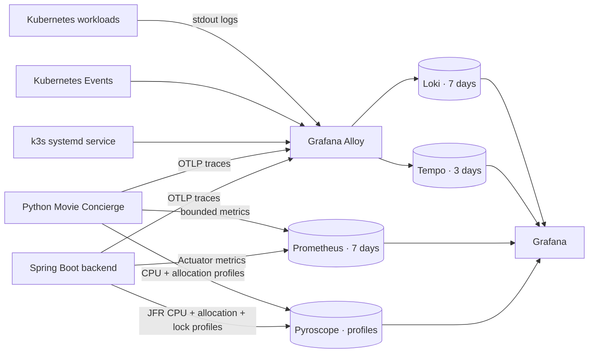

# Observability

Production observability is GitOps-managed in `infrastructure/clusters/home/apps`, not deployed from
the Compose files in this directory.



The stack provides:

- Prometheus for infrastructure, backend, and bounded Movie Concierge metrics and alert rules.
- Loki for logs from every Kubernetes namespace, Kubernetes Events, Traefik access logs, and the
  k3s service journal.
- Tempo for privacy-safe Python/Pydantic AI/MCP/Java distributed traces.
- Pyroscope for continuous CPU and allocation profiles from Python plus CPU, allocation, and lock
  profiles from the Java backend, using bounded sampling, upload intervals, timeouts, and retries.
- Alloy as the per-node log collector and internal OTLP receiver.
- Grafana dashboards, Explore, trace-to-log links, and the authenticated demo viewer.

Agent tracing and profiling exclude prompts, completions, bodies, tool payloads, concrete
conversation IDs, query strings, client addresses, headers, and user-agent values. Loki, Tempo,
and Pyroscope APIs remain private `ClusterIP` services. A NetworkPolicy limits Pyroscope to its own
pod, Grafana, Prometheus, the Java backend, and the Python agent. Allocation profiles identify where
memory is allocated; use Prometheus JVM/process metrics for current heap or resident-memory totals.

## Access and verification

Use the [production operations runbook](../../docs/operations.md) for Grafana, private tunnels,
read-only API checks, and incident response.

Render and validate the complete stack without deploying:

```bash
make verify-observability-production
make verify-observability-charts
make verify-kubernetes-schema
```

Alert rules are evaluated by Prometheus, but Alertmanager notification delivery is intentionally
disabled until an operator destination is selected and secured.

## Legacy files

The `metrics/` Compose stack and its old dashboards are retained for historical reference only.
They are not used by k3s, Argo CD, the production Grafana instance, or the current local workflow.
